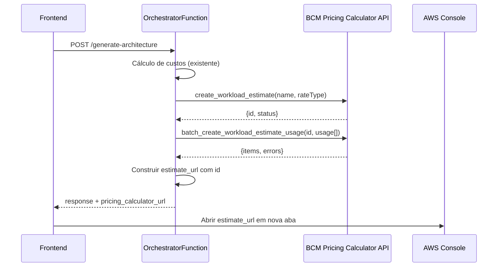
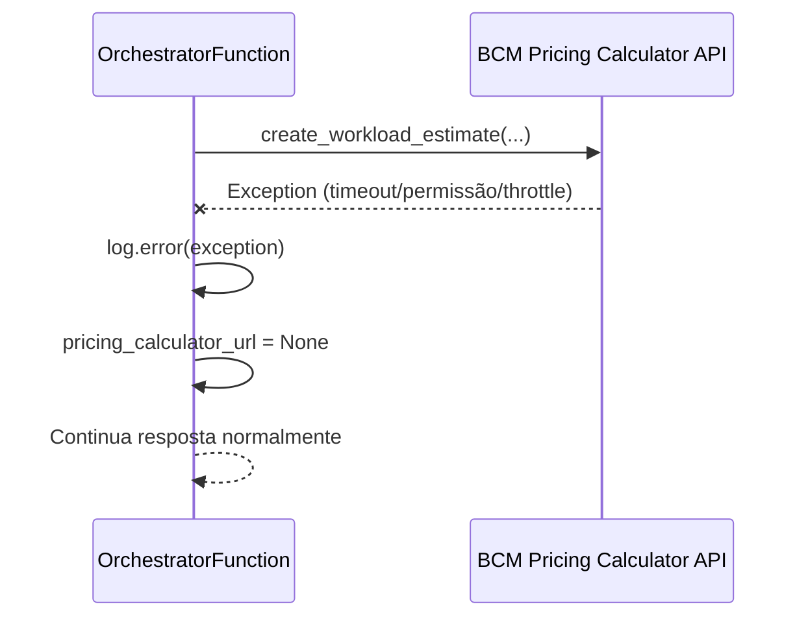

# Design — Integração com AWS Pricing Calculator

## Visão Geral

Esta feature adiciona integração com a API BCM Pricing Calculator da AWS ao Lake House Designer. Após o cálculo de custos existente, o `orchestrator.py` cria programaticamente um **Workload Estimate** na conta AWS do usuário, permitindo que a estimativa oficial fique visível no console AWS Pricing Calculator.

A integração é **não-bloqueante**: qualquer falha na BCM API é capturada silenciosamente, retornando `pricing_calculator_url: null` sem afetar a resposta existente.

### Pesquisa Realizada

- **API BCM Pricing Calculator** ([Documentação AWS](https://docs.aws.amazon.com/aws-cost-management/latest/APIReference/API_AWSBCMPricingCalculator_CreateWorkloadEstimate.html)): A API aceita `name` (padrão `[a-zA-Z0-9-]+`, máx 64 chars), `rateType` opcional (`BEFORE_DISCOUNTS`, `AFTER_DISCOUNTS`, `AFTER_DISCOUNTS_AND_COMMITMENTS`), e retorna um `id` UUID (36 chars, formato `[a-f0-9]{8}-...`).
- **batch_create_workload_estimate_usage** ([boto3 docs](https://docs.aws.amazon.com/boto3/latest/reference/services/bcm-pricing-calculator/client/batch_create_workload_estimate_usage.html)): Aceita `workloadEstimateId` e lista `usage` com campos `serviceCode`, `usageType`, `operation`, `key`, `amount` (float).
- **Permissão IAM**: `bcm-pricing-calculator:CreateWorkloadEstimate` e `bcm-pricing-calculator:CreateWorkloadEstimateUsage` (a operação batch usa a permissão individual).
- **Região**: A API BCM Pricing Calculator opera a partir de `us-east-1`.

### Decisões de Design

1. **Cliente boto3 com região fixa `us-east-1`**: A BCM Pricing Calculator API é um serviço global acessível apenas via `us-east-1`.
2. **Timeout customizado no boto3 Config**: `connect_timeout=5`, `read_timeout=10` para garantir que falhas não excedam o timeout da Lambda (28s).
3. **Bloco try/except isolado**: Toda a lógica BCM fica em uma função separada `create_pricing_calculator_estimate()`, chamada após o cálculo de custos. Falha retorna `None`.
4. **Serviços com custo zero são omitidos**: Não faz sentido criar Usage Items para serviços não utilizados.
5. **Componente BotaoPricingCalculator**: Segue o padrão exato do `BotaoDownload` existente para consistência visual.

## Arquitetura

### Diagrama de Fluxo



### Diagrama de Fluxo de Erro



## Componentes e Interfaces

### Backend — Nova Função `create_pricing_calculator_estimate()`

**Localização**: `backend/src/orchestrator.py`

```python
def create_pricing_calculator_estimate(
    architecture_type: str,
    cost_breakdown: dict[str, float],
    input_params: dict
) -> str | None:
    """
    Cria um Workload Estimate na BCM Pricing Calculator API.
    Retorna a URL do console ou None em caso de falha.
    """
```

**Parâmetros**:
- `architecture_type`: Tipo da arquitetura (`full_lakehouse_with_redshift` ou `light_lakehouse_athena`)
- `cost_breakdown`: Dicionário `{serviço: custo_mensal}` do cálculo existente
- `input_params`: Parâmetros de entrada originais para cálculo de amounts

**Retorno**: URL string ou `None`

### Backend — Constante `SERVICE_CODE_MAPPING`

**Localização**: `backend/src/orchestrator.py` (nível de módulo)

```python
SERVICE_CODE_MAPPING = {
    'S3': {
        'serviceCode': 'AmazonS3',
        'usageType': 'TimedStorage-ByteHrs',
        'operation': 'StandardStorage',
    },
    'Glue': {
        'serviceCode': 'AWSGlue',
        'usageType': 'ETL-DPU-Hour',
        'operation': 'ETLJob',
    },
    'Athena': {
        'serviceCode': 'AmazonAthena',
        'usageType': 'QueryScanned-Bytes',
        'operation': 'QueryExecution',
    },
    'Redshift': {
        'serviceCode': 'AmazonRedshift',
        'usageType': 'Node:ra3.xlplus',
        'operation': 'RunComputeNode',
    },
    'DMS': {
        'serviceCode': 'AWSDatabaseMigrationSvc',
        'usageType': 'dms.r5.large',
        'operation': 'ReplicateData',
    },
    'API Gateway (External)': {
        'serviceCode': 'AmazonApiGateway',
        'usageType': 'ApiGatewayRequest',
        'operation': 'RestApiRequest',
    },
    'QuickSight': {
        'serviceCode': 'AmazonQuickSight',
        'usageType': 'User:Enterprise',
        'operation': 'EnterpriseUser',
    },
    'Lambda': {
        'serviceCode': 'AWSLambda',
        'usageType': 'Lambda-GB-Second',
        'operation': 'Invoke',
    },
}
```

### Backend — Função `build_usage_items()`

```python
def build_usage_items(
    cost_breakdown: dict[str, float],
    input_params: dict
) -> list[dict]:
    """
    Converte o cost_breakdown em lista de Usage Items para a BCM API.
    Omite serviços com custo zero.
    """
```

### Frontend — Interface `ArchitectureOutput` (atualização)

**Localização**: `frontend/src/services/types.ts`

Adicionar campo opcional:
```typescript
pricing_calculator_url?: string;
```

### Frontend — Componente `BotaoPricingCalculator`

**Localização**: `frontend/src/components/BotaoPricingCalculator.tsx`

```typescript
interface BotaoPricingCalculatorProps {
  pricingCalculatorUrl?: string | null;
}

export default function BotaoPricingCalculator({ pricingCalculatorUrl }: BotaoPricingCalculatorProps) {
  // Segue padrão idêntico ao BotaoDownload
}
```

### Frontend — `ResultadoArquitetura.tsx` (atualização)

Adicionar seção após o bloco "Template CloudFormation":
```tsx
{/* Pricing Calculator */}
<div className="bg-white rounded-lg shadow p-4">
  <h2 className="text-lg font-semibold text-gray-800 mb-2">
    AWS Pricing Calculator
  </h2>
  <BotaoPricingCalculator pricingCalculatorUrl={result.pricing_calculator_url} />
</div>
```

### Infraestrutura — `template.yaml` (atualização)

Adicionar política IAM na `OrchestratorFunction`:
```yaml
- Version: "2012-10-17"
  Statement:
    - Effect: Allow
      Action:
        - bcm-pricing-calculator:CreateWorkloadEstimate
        - bcm-pricing-calculator:CreateWorkloadEstimateUsage
      Resource:
        - !Sub "arn:aws:bcm-pricing-calculator:*:${AWS::AccountId}:*"
```

## Modelos de Dados

### Workload Estimate (BCM API Request)

```json
{
  "name": "LakeHouse-full-lakehouse-with-redshift-2024-01-15T10-30-00Z",
  "rateType": "BEFORE_DISCOUNTS"
}
```

**Nota**: O campo `name` aceita apenas `[a-zA-Z0-9-]+` (máx 64 chars). O timestamp ISO8601 usa `-` em vez de `:` para compatibilidade.

### Workload Estimate (BCM API Response)

```json
{
  "id": "a1b2c3d4-e5f6-7890-abcd-ef1234567890",
  "name": "LakeHouse-full-lakehouse-with-redshift-2024-01-15T10-30-00Z",
  "status": "VALID",
  "costCurrency": "USD",
  "totalCost": 0.0,
  "createdAt": 1705312200,
  "expiresAt": 1705916999
}
```

### Usage Item (para batch_create_workload_estimate_usage)

```json
{
  "serviceCode": "AmazonS3",
  "usageType": "TimedStorage-ByteHrs",
  "operation": "StandardStorage",
  "key": "LakeHouse-S3-storage",
  "amount": 1024.0
}
```

### Estimate URL Format

```
https://us-east-1.console.aws.amazon.com/costmanagement/home#/pricing-calculator/workload-estimate/{id}
```

### SERVICE_CODE_MAPPING (Tabela de Referência)

| Serviço Lake House | serviceCode | usageType | operation |
|---|---|---|---|
| S3 | AmazonS3 | TimedStorage-ByteHrs | StandardStorage |
| Glue | AWSGlue | ETL-DPU-Hour | ETLJob |
| Athena | AmazonAthena | QueryScanned-Bytes | QueryExecution |
| Redshift | AmazonRedshift | Node:ra3.xlplus | RunComputeNode |
| DMS | AWSDatabaseMigrationSvc | dms.r5.large | ReplicateData |
| API Gateway (External) | AmazonApiGateway | ApiGatewayRequest | RestApiRequest |
| Lambda | AWSLambda | Lambda-GB-Second | Invoke |
| QuickSight | AmazonQuickSight | User:Enterprise | EnterpriseUser |


## Propriedades de Corretude

*Uma propriedade é uma característica ou comportamento que deve ser verdadeiro em todas as execuções válidas de um sistema — essencialmente, uma declaração formal sobre o que o sistema deve fazer. Propriedades servem como ponte entre especificações legíveis por humanos e garantias de corretude verificáveis por máquina.*

### Propriedade 1: Formato válido do nome do Workload Estimate

*Para qualquer* tipo de arquitetura (`full_lakehouse_with_redshift` ou `light_lakehouse_athena`) e qualquer timestamp válido, o nome gerado para o Workload Estimate deve corresponder ao padrão `[a-zA-Z0-9-]+`, ter no máximo 64 caracteres, e seguir o formato `LakeHouse-{architecture_type}-{timestamp}`.

**Valida: Requisito 1.3**

### Propriedade 2: Round-trip da Estimate URL

*Para qualquer* UUID válido no formato `[a-f0-9]{8}-[a-f0-9]{4}-[a-f0-9]{4}-[a-f0-9]{4}-[a-f0-9]{12}`, construir a Estimate URL e depois extrair o ID da URL deve produzir o UUID original. A URL deve conter `us-east-1` e seguir o formato `https://us-east-1.console.aws.amazon.com/costmanagement/home#/pricing-calculator/workload-estimate/{id}`.

**Valida: Requisitos 1.4, 8.2, 9.1**

### Propriedade 3: Mapeamento correto de serviços

*Para qualquer* cost_breakdown contendo serviços conhecidos (S3, Glue, Athena, Redshift, DMS, API Gateway, Lambda, QuickSight), a função `build_usage_items` deve produzir Usage Items com `serviceCode`, `usageType` e `operation` correspondentes ao `SERVICE_CODE_MAPPING` para cada serviço com custo maior que zero.

**Valida: Requisitos 2.1, 2.3**

### Propriedade 4: Omissão de serviços com custo zero

*Para qualquer* cost_breakdown onde alguns serviços possuem custo igual a zero, a lista de Usage Items gerada não deve conter nenhum item correspondente a serviços com custo zero. O número de Usage Items deve ser igual ao número de serviços com custo maior que zero que possuem mapeamento no `SERVICE_CODE_MAPPING`.

**Valida: Requisito 2.3**

### Propriedade 5: Resiliência a falhas — resposta preservada

*Para qualquer* exceção lançada durante chamadas à BCM Pricing Calculator API (create_workload_estimate ou batch_create_workload_estimate_usage), a resposta da OrchestratorFunction deve conter todos os campos existentes (`architecture_type`, `services`, `estimated_monthly_cost_usd`, `cost_breakdown_per_service`, `diagram_mermaid`, `provisioning_steps`, `message`, `cloudformation_template_url`) com valores idênticos aos que seriam retornados sem a integração, e `pricing_calculator_url` deve ser `null`.

**Valida: Requisitos 3.1, 3.2, 7.1**

### Propriedade 6: Cálculo correto de amounts

*Para qualquer* conjunto de parâmetros de entrada válidos (`data_volume_tb`, `records_per_day_millions`, etc.), os `amount` dos Usage Items gerados devem ser valores numéricos positivos calculados de forma determinística a partir dos parâmetros de entrada e das premissas de uso definidas.

**Valida: Requisito 2.4**

## Tratamento de Erros

### Erros da BCM Pricing Calculator API

| Erro | Causa | Tratamento |
|---|---|---|
| `AccessDeniedException` | Permissões IAM não configuradas | Log warning, retorna `pricing_calculator_url: null` |
| `ThrottlingException` | Rate limit excedido | Log warning, retorna `pricing_calculator_url: null` |
| `ValidationException` | Parâmetros inválidos (nome, serviceCode) | Log error, retorna `pricing_calculator_url: null` |
| `ServiceQuotaExceededException` | Limite de workload estimates atingido | Log warning, retorna `pricing_calculator_url: null` |
| `InternalServerException` | Erro interno da AWS | Log error, retorna `pricing_calculator_url: null` |
| `ConnectTimeoutError` | Timeout de conexão (5s) | Log warning, retorna `pricing_calculator_url: null` |
| `ReadTimeoutError` | Timeout de leitura (10s) | Log warning, retorna `pricing_calculator_url: null` |
| `EndpointConnectionError` | Serviço indisponível | Log error, retorna `pricing_calculator_url: null` |

### Estratégia de Logging

```python
import logging
logger = logging.getLogger(__name__)

# Em caso de erro:
logger.error("Falha ao criar Workload Estimate na BCM Pricing Calculator: %s", str(e))
```

### Fluxo de Erro Detalhado

1. Qualquer exceção dentro de `create_pricing_calculator_estimate()` é capturada pelo `try/except`
2. O erro é registrado com `logger.error()`
3. A função retorna `None`
4. O `lambda_handler` recebe `None` e define `pricing_calculator_url: None` na resposta
5. Todos os outros campos da resposta permanecem inalterados

## Estratégia de Testes

### Testes Unitários (pytest)

1. **test_build_estimate_name**: Verifica formato do nome para diferentes architecture_types
2. **test_build_estimate_url**: Verifica construção da URL com UUIDs conhecidos
3. **test_build_usage_items_filters_zero_cost**: Verifica omissão de serviços com custo zero
4. **test_build_usage_items_mapping**: Verifica mapeamento correto de serviceCode/usageType
5. **test_create_pricing_calculator_estimate_success**: Mock do boto3 client, verifica fluxo completo
6. **test_create_pricing_calculator_estimate_api_error**: Mock com exceção, verifica retorno None
7. **test_lambda_handler_with_bcm_success**: Verifica que pricing_calculator_url está na resposta
8. **test_lambda_handler_with_bcm_failure**: Verifica que resposta existente não é afetada
9. **test_service_code_mapping_completeness**: Verifica que todos os 8 serviços estão mapeados

### Testes de Propriedade (hypothesis)

Biblioteca: **hypothesis** (Python) para backend

Configuração: mínimo 100 iterações por propriedade.

Cada teste de propriedade deve ser anotado com:
- **Feature: aws-pricing-calculator-integration, Property {N}: {texto da propriedade}**

| Propriedade | Teste | Gerador |
|---|---|---|
| 1: Nome válido | Gerar architecture_type e timestamp aleatórios, verificar formato | `st.sampled_from(["full_lakehouse_with_redshift", "light_lakehouse_athena"])`, `st.datetimes()` |
| 2: URL round-trip | Gerar UUIDs aleatórios, construir URL, extrair ID | `st.uuids()` |
| 3: Mapeamento correto | Gerar cost_breakdowns com serviços aleatórios | `st.dictionaries(st.sampled_from(SERVICE_KEYS), st.floats(min_value=0, max_value=10000))` |
| 4: Omissão de custo zero | Gerar cost_breakdowns com mix de zero e não-zero | `st.dictionaries(st.sampled_from(SERVICE_KEYS), st.floats(min_value=0, max_value=10000))` |
| 5: Resiliência a falhas | Gerar exceções aleatórias, verificar resposta preservada | `st.sampled_from([Exception, ConnectionError, TimeoutError, ...])` |
| 6: Amounts positivos | Gerar parâmetros de entrada aleatórios | `st.floats(min_value=0.1, max_value=1000)` para volumes, etc. |

### Testes de Frontend (vitest)

1. **BotaoPricingCalculator.test.tsx**: Renderização com URL válida, null, undefined, string vazia
2. **ResultadoArquitetura.test.tsx**: Verificar que o botão aparece após o template CloudFormation
3. **types.test.ts**: Verificar que ArchitectureOutput aceita pricing_calculator_url opcional

### Testes de Infraestrutura

1. **template.yaml validation**: Verificar que as permissões IAM estão presentes e corretas

## Design de Baixo Nível — Diffs Exatos

### 1. `backend/src/orchestrator.py` — Imports e Constantes

```python
# Adicionar após os imports existentes:
import logging
from botocore.config import Config

logger = logging.getLogger(__name__)

BCM_CLIENT_CONFIG = Config(
    connect_timeout=5,
    read_timeout=10,
    retries={'max_attempts': 1}
)

ESTIMATE_URL_TEMPLATE = (
    "https://us-east-1.console.aws.amazon.com/costmanagement/home"
    "#/pricing-calculator/workload-estimate/{id}"
)

SERVICE_CODE_MAPPING = {
    'S3': {
        'serviceCode': 'AmazonS3',
        'usageType': 'TimedStorage-ByteHrs',
        'operation': 'StandardStorage',
    },
    'Glue': {
        'serviceCode': 'AWSGlue',
        'usageType': 'ETL-DPU-Hour',
        'operation': 'ETLJob',
    },
    'Athena': {
        'serviceCode': 'AmazonAthena',
        'usageType': 'QueryScanned-Bytes',
        'operation': 'QueryExecution',
    },
    'Redshift': {
        'serviceCode': 'AmazonRedshift',
        'usageType': 'Node:ra3.xlplus',
        'operation': 'RunComputeNode',
    },
    'DMS': {
        'serviceCode': 'AWSDatabaseMigrationSvc',
        'usageType': 'dms.r5.large',
        'operation': 'ReplicateData',
    },
    'API Gateway (External)': {
        'serviceCode': 'AmazonApiGateway',
        'usageType': 'ApiGatewayRequest',
        'operation': 'RestApiRequest',
    },
    'QuickSight': {
        'serviceCode': 'AmazonQuickSight',
        'usageType': 'User:Enterprise',
        'operation': 'EnterpriseUser',
    },
    'Lambda': {
        'serviceCode': 'AWSLambda',
        'usageType': 'Lambda-GB-Second',
        'operation': 'Invoke',
    },
}
```

### 2. `backend/src/orchestrator.py` — Novas Funções

```python
def build_estimate_name(architecture_type: str) -> str:
    """Gera nome do Workload Estimate compatível com a API ([a-zA-Z0-9-]+, max 64)."""
    ts = datetime.utcnow().strftime("%Y-%m-%dT%H-%M-%SZ")
    name = f"LakeHouse-{architecture_type}-{ts}"
    return name[:64]


def build_estimate_url(workload_estimate_id: str) -> str:
    """Constrói a URL do console AWS para o Workload Estimate."""
    return ESTIMATE_URL_TEMPLATE.format(id=workload_estimate_id)


def build_usage_items(cost_breakdown: dict, input_params: dict) -> list:
    """Converte cost_breakdown em lista de Usage Items para a BCM API.
    Omite serviços com custo zero ou sem mapeamento."""
    items = []
    for service_name, cost in cost_breakdown.items():
        if cost <= 0:
            continue
        mapping = SERVICE_CODE_MAPPING.get(service_name)
        if not mapping:
            continue
        items.append({
            'serviceCode': mapping['serviceCode'],
            'usageType': mapping['usageType'],
            'operation': mapping['operation'],
            'key': f"LakeHouse-{service_name.replace(' ', '-')}",
            'amount': float(cost),
        })
    return items


def create_pricing_calculator_estimate(
    architecture_type: str,
    cost_breakdown: dict,
    input_params: dict
) -> str | None:
    """Cria Workload Estimate na BCM Pricing Calculator.
    Retorna URL do console ou None em caso de falha."""
    try:
        bcm_client = boto3.client(
            'bcm-pricing-calculator',
            region_name='us-east-1',
            config=BCM_CLIENT_CONFIG
        )

        name = build_estimate_name(architecture_type)

        # 1. Criar Workload Estimate
        create_resp = bcm_client.create_workload_estimate(
            name=name,
            rateType='BEFORE_DISCOUNTS'
        )
        estimate_id = create_resp['id']

        # 2. Adicionar Usage Items
        usage_items = build_usage_items(cost_breakdown, input_params)
        if usage_items:
            bcm_client.batch_create_workload_estimate_usage(
                workloadEstimateId=estimate_id,
                usage=usage_items
            )

        return build_estimate_url(estimate_id)

    except Exception as e:
        logger.error(
            "Falha ao criar Workload Estimate na BCM Pricing Calculator: %s",
            str(e)
        )
        return None
```

### 3. `backend/src/orchestrator.py` — Alteração no `lambda_handler`

Adicionar após o bloco `# 7. Salvar no DynamoDB` e antes de `# 8. Resposta final`:

```python
    # 7.5. Criar estimativa no AWS Pricing Calculator (não-bloqueante)
    pricing_calculator_url = create_pricing_calculator_estimate(
        architecture_type=item['output_architecture'],
        cost_breakdown=cost_breakdown,
        input_params=body
    )
```

Adicionar campo na resposta (dentro do dict `response`):

```python
        "pricing_calculator_url": pricing_calculator_url,
```

### 4. `frontend/src/services/types.ts` — Adicionar campo

```typescript
// Adicionar ao ArchitectureOutput:
  pricing_calculator_url?: string;
```

### 5. `frontend/src/components/BotaoPricingCalculator.tsx` — Novo Componente

```tsx
interface BotaoPricingCalculatorProps {
  pricingCalculatorUrl?: string | null;
}

export default function BotaoPricingCalculator({
  pricingCalculatorUrl,
}: BotaoPricingCalculatorProps) {
  const available =
    !!pricingCalculatorUrl && pricingCalculatorUrl.trim().length > 0;

  const handleClick = () => {
    if (available) {
      window.open(pricingCalculatorUrl, "_blank");
    }
  };

  if (!available) {
    return (
      <button
        disabled
        className="px-4 py-2 text-sm font-medium rounded bg-gray-300 text-gray-500 cursor-not-allowed"
      >
        Estimativa não disponível
      </button>
    );
  }

  return (
    <button
      onClick={handleClick}
      className="px-4 py-2 text-sm font-medium rounded bg-emerald-600 hover:bg-emerald-500 text-white transition-colors"
    >
      Ver no AWS Pricing Calculator
    </button>
  );
}
```

### 6. `frontend/src/components/ResultadoArquitetura.tsx` — Adicionar Seção

Adicionar após a seção "Template CloudFormation" (antes do `</div>` final do `space-y-6`):

```tsx
import BotaoPricingCalculator from "./BotaoPricingCalculator";

// ... dentro do JSX, após a seção Template CloudFormation:

      {/* AWS Pricing Calculator */}
      <div className="bg-white rounded-lg shadow p-4">
        <h2 className="text-lg font-semibold text-gray-800 mb-2">
          AWS Pricing Calculator
        </h2>
        <BotaoPricingCalculator
          pricingCalculatorUrl={result.pricing_calculator_url}
        />
      </div>
```

### 7. `backend/template.yaml` — Política IAM

Adicionar na seção `Policies` da `OrchestratorFunction`, após `CloudWatchLogsFullAccess`:

```yaml
        - Version: "2012-10-17"
          Statement:
            - Effect: Allow
              Action:
                - bcm-pricing-calculator:CreateWorkloadEstimate
                - bcm-pricing-calculator:CreateWorkloadEstimateUsage
              Resource:
                - !Sub "arn:aws:bcm-pricing-calculator:*:${AWS::AccountId}:*"
```
