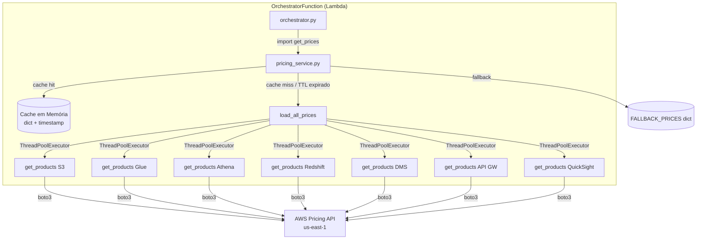
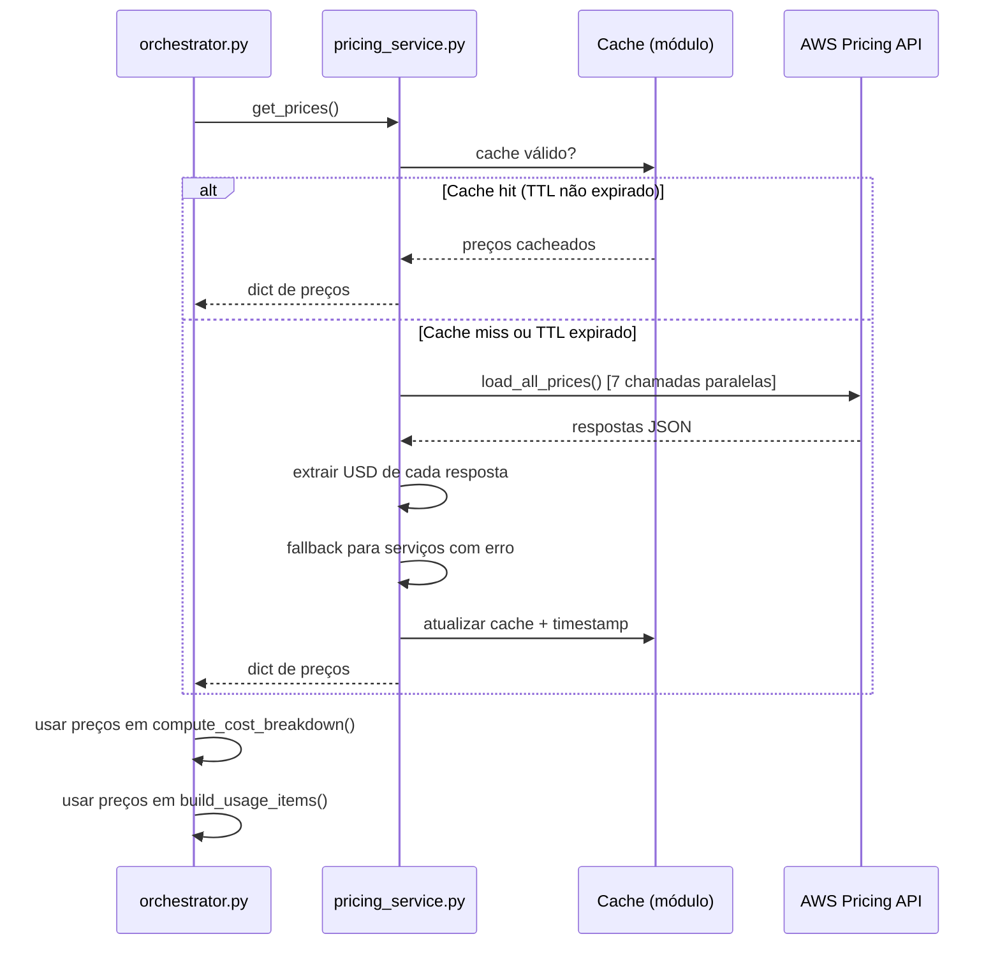

# Documento de Design — API de Precificação Dinâmica (Dynamic Pricing API)

## Visão Geral

Esta feature introduz o módulo `pricing_service.py` que consulta a [AWS Pricing API](https://boto3.amazonaws.com/v1/documentation/api/latest/reference/services/pricing/client/get_products.html) via `boto3.client('pricing')` para obter preços on-demand em tempo real dos 7 serviços AWS utilizados pelo Lake House Designer. Os preços são cacheados em memória Lambda (TTL 24h) e, em caso de falha, o sistema faz fallback para os valores hardcoded atuais — garantindo compatibilidade retroativa total.

### Decisões de Design

1. **Módulo separado (`pricing_service.py`)**: Isola a lógica de precificação do orquestrador, facilitando testes unitários e manutenção.
2. **Cache em nível de módulo**: Variáveis de módulo Python persistem entre invocações warm da Lambda, evitando chamadas desnecessárias à API.
3. **ThreadPoolExecutor para paralelismo**: As 7 chamadas `get_products()` são executadas em paralelo, minimizando latência no cold start.
4. **Fallback gracioso**: Cada serviço tem fallback independente — se a busca de um serviço falha, os demais continuam normalmente.
5. **Região fixa `us-east-1`**: A AWS Pricing API só está disponível em `us-east-1` e `ap-south-1`. Usamos `us-east-1` por proximidade e consistência.

## Arquitetura

### Diagrama de Componentes



### Fluxo de Execução



## Componentes e Interfaces

### Componente 1: `pricing_service.py` (novo arquivo)

#### Interface Pública

```python
def get_prices() -> dict[str, float]:
    """Retorna dicionário de preços atuais dos serviços AWS.
    
    Retorna cache se TTL não expirou, caso contrário busca novos preços.
    Em caso de falha total, retorna FALLBACK_PRICES.
    
    Returns:
        dict com chaves: 's3', 'glue', 'athena', 'redshift', 'dms', 'api_gateway', 'quicksight'
        Valores são preços unitários em USD (float).
    """
```

#### Detalhes Internos (LLD)


```python
import json
import time
import logging
from concurrent.futures import ThreadPoolExecutor, as_completed
import boto3

logger = logging.getLogger(__name__)

# ── Cache em nível de módulo (persiste entre invocações warm) ──
_price_cache: dict[str, float] = {}
_cache_timestamp: float = 0.0
CACHE_TTL_SECONDS: int = 86400  # 24 horas

# ── Preços fallback (valores hardcoded atuais) ──
FALLBACK_PRICES: dict[str, float] = {
    's3': 0.023,           # $/GB-mês
    'glue': 0.44,          # $/DPU-hora
    'athena': 5.0,         # $/TB escaneado
    'redshift': 1.0833,    # $/hora por nó (ra3.xlplus)
    'dms': 0.176,          # $/hora (dms.r5.large)
    'api_gateway': 3.50,   # $/milhão de requisições
    'quicksight': 18.0,    # $/usuário-mês (Enterprise)
}

# ── Mapeamento de serviços → filtros da Pricing API ──
PRICING_CONFIG: dict[str, dict] = {
    's3': {
        'ServiceCode': 'AmazonS3',
        'filters': [
            {'Type': 'TERM_MATCH', 'Field': 'usagetype', 'Value': 'USE1-TimedStorage-ByteHrs'},
            {'Type': 'TERM_MATCH', 'Field': 'location', 'Value': 'US East (N. Virginia)'},
        ],
    },
    'glue': {
        'ServiceCode': 'AWSGlue',
        'filters': [
            {'Type': 'TERM_MATCH', 'Field': 'usagetype', 'Value': 'USE1-Crawler-DPU-Hour'},
            {'Type': 'TERM_MATCH', 'Field': 'location', 'Value': 'US East (N. Virginia)'},
        ],
    },
    'athena': {
        'ServiceCode': 'AmazonAthena',
        'filters': [
            {'Type': 'TERM_MATCH', 'Field': 'usagetype', 'Value': 'USE1-DataScannedInTB'},
            {'Type': 'TERM_MATCH', 'Field': 'location', 'Value': 'US East (N. Virginia)'},
        ],
    },
    'redshift': {
        'ServiceCode': 'AmazonRedshift',
        'filters': [
            {'Type': 'TERM_MATCH', 'Field': 'usagetype', 'Value': 'CS:ra3.xlplus'},
            {'Type': 'TERM_MATCH', 'Field': 'location', 'Value': 'US East (N. Virginia)'},
        ],
    },
    'dms': {
        'ServiceCode': 'AWSDatabaseMigrationSvc',
        'filters': [
            {'Type': 'TERM_MATCH', 'Field': 'usagetype', 'Value': 'InstanceUsg:dms.r5.large'},
            {'Type': 'TERM_MATCH', 'Field': 'location', 'Value': 'US East (N. Virginia)'},
        ],
    },
    'api_gateway': {
        'ServiceCode': 'AmazonApiGateway',
        'filters': [
            {'Type': 'TERM_MATCH', 'Field': 'usagetype', 'Value': 'USE1-ApiGatewayRequest'},
            {'Type': 'TERM_MATCH', 'Field': 'location', 'Value': 'US East (N. Virginia)'},
        ],
    },
    'quicksight': {
        'ServiceCode': 'AmazonQuickSight',
        'filters': [
            {'Type': 'TERM_MATCH', 'Field': 'usagetype', 'Value': 'USE1-User:Enterprise'},
            {'Type': 'TERM_MATCH', 'Field': 'location', 'Value': 'US East (N. Virginia)'},
        ],
    },
}


def _create_pricing_client():
    """Cria cliente boto3 da Pricing API (região fixa us-east-1)."""
    return boto3.client('pricing', region_name='us-east-1')


def fetch_price(pricing_client, service_code: str, filters: list[dict]) -> float | None:
    """Busca preço unitário USD de um serviço via get_products().
    
    Args:
        pricing_client: Cliente boto3 da Pricing API.
        service_code: Código do serviço AWS (ex: 'AmazonS3').
        filters: Lista de filtros para get_products().
    
    Returns:
        Preço em USD (float) ou None se não encontrado.
    """
    try:
        response = pricing_client.get_products(
            ServiceCode=service_code,
            Filters=filters,
            FormatVersion='aws_v1',
            MaxResults=10,
        )
        for price_item_json in response.get('PriceList', []):
            price_item = json.loads(price_item_json)
            terms = price_item.get('terms', {}).get('OnDemand', {})
            for term_key, term_value in terms.items():
                for dim_key, dim_value in term_value.get('priceDimensions', {}).items():
                    usd = dim_value.get('pricePerUnit', {}).get('USD')
                    if usd:
                        price = float(usd)
                        if price > 0:
                            return price
        return None
    except Exception as e:
        logger.warning("Erro ao buscar preço para %s: %s", service_code, str(e))
        return None


def load_all_prices() -> dict[str, float]:
    """Busca preços de todos os 7 serviços em paralelo via ThreadPoolExecutor.
    
    Returns:
        dict com preços obtidos. Serviços com falha usam FALLBACK_PRICES.
    """
    start_time = time.time()
    pricing_client = _create_pricing_client()
    prices = dict(FALLBACK_PRICES)  # começa com fallback
    fallback_services = []

    def _fetch_one(service_key: str) -> tuple[str, float | None]:
        config = PRICING_CONFIG[service_key]
        price = fetch_price(pricing_client, config['ServiceCode'], config['filters'])
        return service_key, price

    with ThreadPoolExecutor(max_workers=7) as executor:
        futures = {executor.submit(_fetch_one, key): key for key in PRICING_CONFIG}
        for future in as_completed(futures):
            service_key, price = future.result()
            if price is not None:
                prices[service_key] = price
            else:
                fallback_services.append(service_key)

    elapsed_ms = (time.time() - start_time) * 1000

    if fallback_services:
        logger.warning(
            "Preços fallback utilizados para: %s", ', '.join(fallback_services)
        )
    else:
        logger.info(
            "Preços dinâmicos carregados com sucesso para %d serviços em %.0fms",
            len(PRICING_CONFIG), elapsed_ms,
        )

    return prices


def get_prices() -> dict[str, float]:
    """Retorna preços cacheados ou busca novos se TTL expirou.
    
    Returns:
        dict com chaves: 's3', 'glue', 'athena', 'redshift', 'dms', 'api_gateway', 'quicksight'
    """
    global _price_cache, _cache_timestamp

    now = time.time()
    if _price_cache and (now - _cache_timestamp) < CACHE_TTL_SECONDS:
        remaining_min = (CACHE_TTL_SECONDS - (now - _cache_timestamp)) / 60
        logger.debug("Cache hit de preços. TTL restante: %.0f minutos", remaining_min)
        return dict(_price_cache)

    _price_cache = load_all_prices()
    _cache_timestamp = now
    return dict(_price_cache)
```

### Componente 2: Alterações em `orchestrator.py`

#### Import

```python
from pricing_service import get_prices
```

#### Alteração em `lambda_handler()`

No início da função, antes do cálculo de custos:

```python
    # Obter preços dinâmicos
    prices = get_prices()
```

Passar `prices` para todas as funções de custo:

```python
    cost_breakdown = compute_cost_breakdown(volume_tb, records_per_day_millions, use_redshift, redshift_node_count, prices)

    if dms_cdc_enabled and dms_cdc_db_count > 0:
        cost_breakdown['DMS'] = compute_dms_cost(dms_cdc_db_count, prices)

    if data_source_count > 0:
        cost_breakdown['Glue'] = round(cost_breakdown.get('Glue', 0) + compute_additional_glue_cost(data_source_count, prices), 2)

    if external_api_count > 0:
        cost_breakdown['API Gateway (External)'] = compute_external_api_cost(external_api_count, prices)
```

E para `build_usage_items`:

```python
    usage_items = build_usage_items(cost_breakdown, input_params, prices)
```

#### Alteração em `compute_cost_breakdown()`

```python
def compute_cost_breakdown(volume_tb, records_per_day_millions, use_redshift, redshift_node_count=2, prices=None):
    if prices is None:
        from pricing_service import FALLBACK_PRICES
        prices = FALLBACK_PRICES

    cost = {}
    cost['S3'] = round(volume_tb * 1024 * prices['s3'] + (records_per_day_millions * 1e6 * 30) * 0.0000004, 2)
    cost['Glue'] = round(2 * 30 * prices['glue'], 2)
    cost['Athena'] = round(200 * 30 * (prices['athena'] / 1000), 2)  # $5/TB → $0.005/GB
    if use_redshift:
        cost['Redshift'] = round(redshift_node_count * prices['redshift'] * 24 * 30, 2)
        cost['QuickSight'] = round(prices['quicksight'], 2)
    else:
        cost['Redshift'] = 0.0
        cost['QuickSight'] = 0.0
    cost['Lake Formation'] = 0.0
    return cost
```

#### Alteração em `compute_dms_cost()`

```python
def compute_dms_cost(db_count, prices=None):
    if prices is None:
        from pricing_service import FALLBACK_PRICES
        prices = FALLBACK_PRICES

    instance_cost = prices['dms'] * 24 * 30
    storage_cost = 50 * 0.10
    task_cost = db_count * 10.0
    return round(instance_cost + storage_cost + task_cost, 2)
```

#### Alteração em `compute_additional_glue_cost()`

```python
def compute_additional_glue_cost(source_count, prices=None):
    if prices is None:
        from pricing_service import FALLBACK_PRICES
        prices = FALLBACK_PRICES

    crawler_cost = 2 * 0.5 * prices['glue'] * 1 * 30
    job_cost = 2 * 1.0 * prices['glue'] * 1 * 30
    return round(source_count * (crawler_cost + job_cost), 2)
```

#### Alteração em `compute_external_api_cost()`

```python
def compute_external_api_cost(api_count, prices=None):
    if prices is None:
        from pricing_service import FALLBACK_PRICES
        prices = FALLBACK_PRICES

    api_gw = prices['api_gateway']
    lambda_invocations = 0.20
    lambda_compute = 1_000_000 * 0.125 * 0.2 * 0.0000166667
    data_transfer = 10 * 0.09
    cost_per_api = api_gw + lambda_invocations + lambda_compute + data_transfer
    return round(api_count * cost_per_api, 2)
```

#### Alteração em `build_usage_items()`

```python
def build_usage_items(cost_breakdown, input_params, prices=None):
    if prices is None:
        from pricing_service import FALLBACK_PRICES
        prices = FALLBACK_PRICES

    account_id = boto3.client('sts').get_caller_identity()['Account']
    # ... (parâmetros existentes) ...

    # Divisores dinâmicos com proteção contra divisão por zero
    def safe_divisor(key):
        from pricing_service import FALLBACK_PRICES
        p = prices.get(key, 0)
        return p if p > 0 else FALLBACK_PRICES[key]

    usage_amounts = {
        'S3': cost_breakdown.get('S3', 0) / safe_divisor('s3') if cost_breakdown.get('S3', 0) > 0 else 0,
        'Glue': cost_breakdown.get('Glue', 0) / safe_divisor('glue') if cost_breakdown.get('Glue', 0) > 0 else 0,
        'Athena': cost_breakdown.get('Athena', 0) / safe_divisor('athena') if cost_breakdown.get('Athena', 0) > 0 else 0,
        'Redshift': (cost_breakdown.get('Redshift', 0) / safe_divisor('redshift')) * 3600 if cost_breakdown.get('Redshift', 0) > 0 else 0,
        'DMS': cost_breakdown.get('DMS', 0) / safe_divisor('dms') if cost_breakdown.get('DMS', 0) > 0 else 0,
        'API Gateway (External)': cost_breakdown.get('API Gateway (External)', 0) / (safe_divisor('api_gateway') / 1_000_000) if cost_breakdown.get('API Gateway (External)', 0) > 0 else 0,
        'QuickSight': max(1, cost_breakdown.get('QuickSight', 0) / safe_divisor('quicksight')) if cost_breakdown.get('QuickSight', 0) > 0 else 0,
    }
    # ... (restante da função inalterado) ...
```

### Componente 3: Alterações em `template.yaml`

Adicionar permissão de Pricing API à `OrchestratorFunction`:

```yaml
      Policies:
        - DynamoDBCrudPolicy:
            TableName: !Ref HistoryTable
        - S3CrudPolicy:
            BucketName: !Ref TemplatesBucket
        - CloudWatchLogsFullAccess
        - Version: "2012-10-17"
          Statement:
            - Effect: Allow
              Action:
                - bcm-pricing-calculator:CreateWorkloadEstimate
                - bcm-pricing-calculator:CreateWorkloadEstimateUsage
              Resource:
                - !Sub "arn:aws:bcm-pricing-calculator:*:${AWS::AccountId}:*"
        - Version: "2012-10-17"
          Statement:
            - Effect: Allow
              Action:
                - pricing:GetProducts
                - pricing:DescribeServices
              Resource: "*"
```

## Modelos de Dados

### Estrutura do Cache

```python
# Variáveis de módulo em pricing_service.py
_price_cache: dict[str, float] = {}   # ex: {'s3': 0.023, 'glue': 0.44, ...}
_cache_timestamp: float = 0.0          # time.time() da última busca
CACHE_TTL_SECONDS: int = 86400         # 24 horas
```

### Estrutura do Dicionário de Preços

```python
{
    's3': 0.023,           # $/GB-mês (S3 Standard Storage)
    'glue': 0.44,          # $/DPU-hora (Glue Crawler)
    'athena': 5.0,         # $/TB escaneado
    'redshift': 1.0833,    # $/hora por nó (ra3.xlplus)
    'dms': 0.176,          # $/hora (dms.r5.large)
    'api_gateway': 3.50,   # $/milhão de requisições
    'quicksight': 18.0,    # $/usuário-mês (Enterprise)
}
```

### Estrutura da Resposta da AWS Pricing API

A resposta de `get_products()` retorna `PriceList` como lista de strings JSON. Cada item tem a estrutura aninhada:

```
product.terms.OnDemand.<termKey>.priceDimensions.<dimKey>.pricePerUnit.USD
```

O `fetch_price()` navega essa estrutura e retorna o primeiro valor USD > 0.

### Mapeamento PRICING_CONFIG

Cada entrada mapeia uma chave interna (ex: `'s3'`) para:
- `ServiceCode`: código do serviço na AWS Pricing API
- `filters`: lista de filtros `TERM_MATCH` incluindo `usagetype` e `location`


## Propriedades de Corretude

*Uma propriedade é uma característica ou comportamento que deve ser verdadeiro em todas as execuções válidas de um sistema — essencialmente, uma declaração formal sobre o que o sistema deve fazer. Propriedades servem como ponte entre especificações legíveis por humanos e garantias de corretude verificáveis por máquina.*

### Propriedade 1: Extração de preço USD da resposta da API

*Para qualquer* resposta válida da AWS Pricing API contendo uma lista de produtos com estrutura `terms.OnDemand.<key>.priceDimensions.<key>.pricePerUnit.USD`, `fetch_price` deve retornar o primeiro valor USD numérico maior que zero. Se nenhum produto contém um preço USD válido > 0, deve retornar `None`.

**Valida: Requisitos 1.4, 1.5**

### Propriedade 2: Comportamento do cache baseado em TTL

*Para qualquer* dicionário de preços cacheado e qualquer timestamp, `get_prices()` deve retornar os valores do cache sem chamar `load_all_prices()` se e somente se a diferença entre o timestamp atual e o timestamp do cache for menor que `CACHE_TTL_SECONDS` (86400s). Caso contrário, deve invocar `load_all_prices()` e atualizar o cache.

**Valida: Requisitos 2.2, 2.4**

### Propriedade 3: Fallback em caso de falha da API

*Para qualquer* serviço AWS onde `fetch_price` retorna `None` (seja por exceção, timeout, ou resposta sem preço USD válido), `load_all_prices()` deve retornar o valor correspondente de `FALLBACK_PRICES` para esse serviço.

**Valida: Requisitos 3.2, 3.3**

### Propriedade 4: Isolamento de falhas parciais

*Para qualquer* subconjunto de serviços que falham durante a busca paralela em `load_all_prices()`, os serviços que falharam devem receber preços de `FALLBACK_PRICES`, enquanto os serviços que tiveram sucesso devem manter seus preços dinâmicos obtidos da API. Nenhuma falha individual deve impedir a obtenção de preços dos demais serviços.

**Valida: Requisito 4.3**

### Propriedade 5: Funções de custo utilizam preços dinâmicos

*Para qualquer* dicionário de preços válido (com valores > 0), as funções `compute_cost_breakdown()`, `compute_dms_cost()`, `compute_additional_glue_cost()` e `compute_external_api_cost()` devem produzir custos que variam proporcionalmente ao preço fornecido para o serviço correspondente. Especificamente, dobrar o preço de um serviço deve dobrar o componente de custo desse serviço no resultado.

**Valida: Requisitos 6.1, 6.2, 6.3, 6.4, 6.5, 6.6, 6.7**

### Propriedade 6: Divisores dinâmicos em build_usage_items com proteção contra zero

*Para qualquer* dicionário de preços (incluindo valores zero) e qualquer cost_breakdown com custos > 0, `build_usage_items()` deve computar quantidades de uso como `custo / preço_dinâmico` para cada serviço. Se o preço dinâmico de um serviço for zero, deve utilizar o valor correspondente de `FALLBACK_PRICES` como divisor, nunca resultando em divisão por zero.

**Valida: Requisitos 7.1, 7.2**

### Propriedade 7: Compatibilidade retroativa com preços fallback

*Para qualquer* conjunto de parâmetros de entrada válidos, quando `get_prices()` retorna exatamente os valores de `FALLBACK_PRICES`, as funções de custo devem produzir resultados idênticos (bit a bit, após arredondamento) aos produzidos pelo sistema com os valores hardcoded originais.

**Valida: Requisito 9.3**

## Tratamento de Erros

### Erros na AWS Pricing API

| Cenário | Comportamento | Log |
|---------|--------------|-----|
| `get_products()` lança exceção (timeout, throttling, acesso negado) | `fetch_price` retorna `None` → fallback | WARNING com serviço e motivo |
| Resposta sem `PriceList` ou lista vazia | `fetch_price` retorna `None` → fallback | WARNING |
| Todos os preços USD são 0 ou ausentes | `fetch_price` retorna `None` → fallback | WARNING |
| Todas as 7 chamadas falham | `load_all_prices` retorna `FALLBACK_PRICES` completo | WARNING com lista de todos os serviços |

### Erros no Cache

| Cenário | Comportamento |
|---------|--------------|
| Cold start (cache vazio) | `get_prices()` chama `load_all_prices()` |
| Cache corrompido (improvável) | `get_prices()` chama `load_all_prices()` |

### Erros nas Funções de Custo

| Cenário | Comportamento |
|---------|--------------|
| `prices` é `None` | Funções importam e usam `FALLBACK_PRICES` |
| Preço dinâmico é 0 (divisor) | `safe_divisor()` retorna `FALLBACK_PRICES[key]` |

## Estratégia de Testes

### Abordagem Dual

A estratégia combina testes unitários (exemplos específicos) com testes baseados em propriedades (verificação universal).

### Biblioteca de Property-Based Testing

- **Biblioteca**: [Hypothesis](https://hypothesis.readthedocs.io/) (Python)
- **Iterações mínimas**: 100 por propriedade (`@settings(max_examples=100)`)
- **Tag**: Cada teste deve conter um comentário no formato: `# Feature: dynamic-pricing-api, Property {N}: {texto}`

### Testes Baseados em Propriedades (PBT)

| Propriedade | Descrição | Gerador |
|-------------|-----------|---------|
| 1 | Extração de preço USD | Gerar respostas JSON da Pricing API com estrutura válida, variando número de produtos, termos e valores de preço |
| 2 | Cache TTL | Gerar timestamps e dicts de preços aleatórios, variar delta de tempo em relação ao TTL |
| 3 | Fallback em falha | Gerar exceções aleatórias e respostas malformadas para subconjuntos de serviços |
| 4 | Isolamento de falhas | Gerar subconjuntos aleatórios de serviços que falham vs. que têm sucesso |
| 5 | Preços dinâmicos nas funções de custo | Gerar dicts de preços com valores positivos aleatórios e parâmetros de entrada variados |
| 6 | Divisores dinâmicos | Gerar dicts de preços (incluindo zeros) e cost_breakdowns aleatórios |
| 7 | Compatibilidade retroativa | Gerar parâmetros de entrada aleatórios, comparar resultado com fallback vs. hardcoded |

### Testes Unitários (Exemplos)

- Verificar que `FALLBACK_PRICES` contém os 7 serviços com valores corretos (3.1)
- Verificar que `PRICING_CONFIG` contém filtros corretos para cada serviço (5.1)
- Verificar que todos os filtros incluem `location='US East (N. Virginia)'` (5.2)
- Verificar que `CACHE_TTL_SECONDS == 86400` (2.3)
- Verificar logging INFO em sucesso total (3.5, 10.1)
- Verificar logging WARNING em fallback parcial (3.4, 10.2)
- Verificar logging DEBUG em cache hit (10.3)
- Verificar que cold start (cache vazio) chama `load_all_prices` (2.5)
- Verificar que 7 chamadas paralelas são feitas em `load_all_prices` (4.2)

### Testes de Integração

- Verificar formato de resposta JSON do `lambda_handler` com pricing service mockado (9.1, 9.2)
- Verificar que `template.yaml` contém permissões `pricing:GetProducts` e `pricing:DescribeServices` (8.1, 8.2, 8.3)

### Estrutura de Arquivos de Teste

```
backend/src/
├── pricing_service.py          # Novo módulo
├── orchestrator.py             # Alterado
├── test_pricing_service.py     # Testes unitários + PBT do pricing_service
└── test_orchestrator_pricing.py # Testes de integração orchestrator + pricing
```
