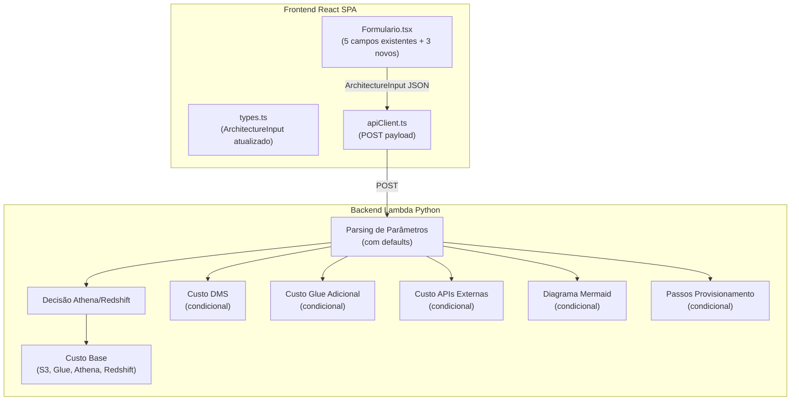

# Documento de Design — Estimativa de Custo Aprimorada (Enhanced Cost Estimation)

## Visão Geral

Esta melhoria estende o Lake House Designer para incluir 3 novos parâmetros de entrada que tornam a estimativa de custo mais realista:

1. **DMS CDC** — toggle booleano + campo condicional de quantidade de bancos de dados
2. **Fontes de Coleta Automatizada** — campo numérico (padrão 0)
3. **APIs de Exposição de Dados Externos** — campo numérico (padrão 0)

As alterações impactam duas camadas:
- **Frontend (React/TypeScript)**: novos campos no `Formulario.tsx`, atualização da interface `ArchitectureInput` em `types.ts`
- **Backend (Python Lambda)**: parsing de novos parâmetros, novas funções de cálculo de custo, diagrama Mermaid condicional e passos de provisionamento condicionais no `orchestrator.py`

Os componentes de exibição (`ResultadoArquitetura`, `TabelaCusto`, `DiagramaMermaid`) **não precisam de alteração** — eles já renderizam dados dinâmicos retornados pelo backend.

### Decisões de Design

| Decisão | Escolha | Justificativa |
|---------|---------|---------------|
| Compatibilidade retroativa | Valores padrão no backend | Requisições existentes sem novos campos continuam funcionando (Req. 10) |
| Toggle DMS CDC | Checkbox com campo condicional | UX clara: campo de quantidade só aparece quando CDC está ativo (Req. 1) |
| Campos opcionais vs obrigatórios | `data_source_count` e `external_api_count` com padrão 0 | Permite envio sem preencher, sem impacto no custo base (Reqs. 2, 3) |
| Custos como entradas separadas | Chaves distintas no `cost_breakdown_per_service` | "DMS", "Glue" (acumulado), "API Gateway (External)" — visibilidade por serviço (Reqs. 5, 6, 7) |
| Validação de entrada no backend | `max(int(value), 0)` com fallback para 0 | Robustez contra valores inválidos/ausentes (Req. 12.5) |

### Referência de Preços AWS (us-east-1)

| Serviço | Componente | Preço |
|---------|-----------|-------|
| DMS | Instância dms.r5.large | $0.192/hora |
| DMS | Armazenamento (logs CDC) | $0.10/GB/mês |
| DMS | Overhead por tarefa (estimativa) | ~$10/mês/tarefa |
| Glue | DPU-hora | $0.44 |
| Glue | Crawler (estimativa: 2 DPU × 0.5h × execuções/dia) | Variável |
| Glue | Job (estimativa: 2 DPU × 1h × execuções/dia) | Variável |
| API Gateway | Requisições REST | $3.50/milhão |
| Lambda | Invocações | $0.20/milhão |
| Lambda | Compute (128MB, 200ms) | ~$0.0000002083/invocação |
| Data Transfer | Saída para internet | $0.09/GB |

## Arquitetura

### Diagrama de Alto Nível — Fluxo de Dados Atualizado



### Impacto por Arquivo

| Arquivo | Tipo de Alteração | Descrição |
|---------|-------------------|-----------|
| `frontend/src/services/types.ts` | Modificação | Adicionar 4 campos à interface `ArchitectureInput` |
| `frontend/src/components/Formulario.tsx` | Modificação | Adicionar 3 novos campos de entrada (toggle DMS + campo condicional, fontes, APIs) |
| `backend/src/orchestrator.py` | Modificação | Parsing, cálculo de custo, diagrama e passos condicionais |

## Componentes e Interfaces

### Design de Alto Nível (HLD)

#### Frontend — Alterações na Interface `ArchitectureInput`

Arquivo: `frontend/src/services/types.ts`

**Estado atual:**
```typescript
export interface ArchitectureInput {
  data_volume_tb: number;
  records_per_day_millions: number;
  avg_query_complexity: "low" | "medium" | "high";
  max_query_latency_sec: number;
  concurrent_users: number;
}
```

**Estado proposto:**
```typescript
export interface ArchitectureInput {
  data_volume_tb: number;
  records_per_day_millions: number;
  avg_query_complexity: "low" | "medium" | "high";
  max_query_latency_sec: number;
  concurrent_users: number;
  // Novos campos
  dms_cdc_enabled: boolean;
  dms_cdc_db_count?: number;       // Obrigatório quando dms_cdc_enabled === true
  data_source_count: number;        // Padrão: 0
  external_api_count: number;       // Padrão: 0
}
```

#### Frontend — Alterações no `Formulario.tsx`

Novos campos a adicionar ao formulário (após os 5 campos existentes):

1. **DMS CDC Toggle** — checkbox/toggle com label "DMS CDC (Change Data Capture)"
   - Padrão: desmarcado (false)
   - Quando marcado, exibe campo numérico "Quantidade de Bancos de Dados"
   - Validação condicional: se ativo, quantidade deve ser > 0

2. **Fontes de Coleta Automatizada** — campo numérico
   - Padrão: 0
   - Validação: >= 0

3. **APIs de Exposição de Dados Externos** — campo numérico
   - Padrão: 0
   - Validação: >= 0

#### Backend — Novas Funções no `orchestrator.py`

| Função | Descrição |
|--------|-----------|
| `compute_dms_cost(db_count)` | Calcula custo mensal de DMS CDC |
| `compute_additional_glue_cost(source_count)` | Calcula custo adicional de Glue por fonte |
| `compute_external_api_cost(api_count)` | Calcula custo de API Gateway + Lambda + Data Transfer |
| `get_mermaid_diagram(use_redshift, dms_enabled, source_count, api_count)` | Diagrama condicional |
| `get_provisioning_steps(use_redshift, dms_enabled, source_count, api_count)` | Passos condicionais |

### Design de Baixo Nível (LLD)

#### 1. `frontend/src/services/types.ts` — Diff Proposto

```diff
 export interface ArchitectureInput {
   data_volume_tb: number;
   records_per_day_millions: number;
   avg_query_complexity: "low" | "medium" | "high";
   max_query_latency_sec: number;
   concurrent_users: number;
+  dms_cdc_enabled: boolean;
+  dms_cdc_db_count?: number;
+  data_source_count: number;
+  external_api_count: number;
 }
```

Nenhuma alteração necessária em `ArchitectureOutput` — o backend já retorna `services: string[]` e `cost_breakdown_per_service: Record<string, number>` que são dinâmicos.

#### 2. `frontend/src/components/Formulario.tsx` — Alterações Detalhadas

**2.1 Atualização do `FormState`:**

```diff
 interface FormState {
   data_volume_tb: string;
   records_per_day_millions: string;
   avg_query_complexity: "low" | "medium" | "high";
   max_query_latency_sec: string;
   concurrent_users: string;
+  dms_cdc_enabled: boolean;
+  dms_cdc_db_count: string;
+  data_source_count: string;
+  external_api_count: string;
 }

 const INITIAL: FormState = {
   data_volume_tb: "",
   records_per_day_millions: "",
   avg_query_complexity: "medium",
   max_query_latency_sec: "",
   concurrent_users: "",
+  dms_cdc_enabled: false,
+  dms_cdc_db_count: "",
+  data_source_count: "0",
+  external_api_count: "0",
 };
```

**2.2 Atualização da função `validate()`:**

```typescript
const validate = (): boolean => {
  const e: Record<string, string> = {};
  
  // Validação existente dos 4 campos numéricos obrigatórios (> 0)
  const numericFields: (keyof FormState)[] = [
    "data_volume_tb", "records_per_day_millions",
    "max_query_latency_sec", "concurrent_users",
  ];
  for (const f of numericFields) {
    const raw = form[f] as string;
    if (!raw.trim()) { e[f] = "Campo obrigatório"; }
    else if (Number(raw) <= 0 || isNaN(Number(raw))) { e[f] = "O valor deve ser positivo"; }
  }

  // NOVO: Validação condicional do DMS CDC
  if (form.dms_cdc_enabled) {
    const raw = form.dms_cdc_db_count;
    if (!raw.trim()) { e.dms_cdc_db_count = "Campo obrigatório"; }
    else if (Number(raw) <= 0 || isNaN(Number(raw)) || !Number.isInteger(Number(raw))) {
      e.dms_cdc_db_count = "O valor deve ser um inteiro positivo";
    }
  }

  // NOVO: Validação de fontes (>= 0)
  const nonNegFields: (keyof FormState)[] = ["data_source_count", "external_api_count"];
  for (const f of nonNegFields) {
    const raw = form[f] as string;
    if (raw.trim() !== "" && (Number(raw) < 0 || isNaN(Number(raw)))) {
      e[f] = "O valor deve ser zero ou positivo";
    }
  }

  setErrors(e);
  return Object.keys(e).length === 0;
};
```

**2.3 Atualização do `handleSubmit()`:**

```typescript
const handleSubmit = (e: React.FormEvent) => {
  e.preventDefault();
  if (!validate()) return;

  const payload: ArchitectureInput = {
    data_volume_tb: Number(form.data_volume_tb),
    records_per_day_millions: Number(form.records_per_day_millions),
    avg_query_complexity: form.avg_query_complexity,
    max_query_latency_sec: Number(form.max_query_latency_sec),
    concurrent_users: Number(form.concurrent_users),
    // Novos campos
    dms_cdc_enabled: form.dms_cdc_enabled,
    ...(form.dms_cdc_enabled && { dms_cdc_db_count: Number(form.dms_cdc_db_count) }),
    data_source_count: Number(form.data_source_count) || 0,
    external_api_count: Number(form.external_api_count) || 0,
  };

  onSubmit(payload);
};
```

**2.4 Novos campos JSX** (após o grid existente de 5 campos):

```tsx
{/* Separador visual */}
<div className="border-t border-gray-200 pt-4 mt-2">
  <h3 className="text-sm font-semibold text-gray-600 mb-3">
    Serviços Adicionais (Opcional)
  </h3>
</div>

{/* DMS CDC Toggle */}
<div className="col-span-1 sm:col-span-2">
  <label className="flex items-center gap-2 text-sm font-medium text-gray-700">
    <input
      type="checkbox"
      checked={form.dms_cdc_enabled}
      onChange={(e) => setForm((prev) => ({
        ...prev,
        dms_cdc_enabled: e.target.checked,
        ...(! e.target.checked && { dms_cdc_db_count: "" }),
      }))}
      className="rounded border-gray-300 text-indigo-600 focus:ring-indigo-500"
    />
    DMS CDC (Change Data Capture)
  </label>
</div>

{/* Campo condicional: Quantidade de Bancos */}
{form.dms_cdc_enabled && (
  <div>
    <label className="block text-sm font-medium text-gray-700 mb-1">
      Quantidade de Bancos de Dados
    </label>
    <input
      type="number"
      step="1"
      min="1"
      value={form.dms_cdc_db_count}
      onChange={(e) => set("dms_cdc_db_count", e.target.value)}
      className={inputClass}
    />
    {errors.dms_cdc_db_count && (
      <p className="text-red-600 text-xs mt-1">{errors.dms_cdc_db_count}</p>
    )}
  </div>
)}

{/* Fontes de Coleta Automatizada */}
<div>
  <label className="block text-sm font-medium text-gray-700 mb-1">
    Fontes de Coleta Automatizada
  </label>
  <input
    type="number"
    step="1"
    min="0"
    value={form.data_source_count}
    onChange={(e) => set("data_source_count", e.target.value)}
    className={inputClass}
  />
  {errors.data_source_count && (
    <p className="text-red-600 text-xs mt-1">{errors.data_source_count}</p>
  )}
</div>

{/* APIs de Exposição de Dados Externos */}
<div>
  <label className="block text-sm font-medium text-gray-700 mb-1">
    APIs de Exposição de Dados Externos
  </label>
  <input
    type="number"
    step="1"
    min="0"
    value={form.external_api_count}
    onChange={(e) => set("external_api_count", e.target.value)}
    className={inputClass}
  />
  {errors.external_api_count && (
    <p className="text-red-600 text-xs mt-1">{errors.external_api_count}</p>
  )}
</div>
```

#### 3. `backend/src/orchestrator.py` — Alterações Detalhadas

**3.1 Parsing de novos parâmetros no `lambda_handler()`:**

```diff
 def lambda_handler(event, context):
     body = json.loads(event.get('body', '{}'))
     volume_tb = body.get('data_volume_tb', 0)
     records_per_day_millions = body.get('records_per_day_millions', 0)
     query_complexity = body.get('avg_query_complexity', 'medium')
     latency_sec = body.get('max_query_latency_sec', 60)
     concurrent_users = body.get('concurrent_users', 5)
     user_id = event.get('requestContext', {}).get('authorizer', {}).get('principalId', 'anonymous')
+
+    # Novos parâmetros com defaults para compatibilidade retroativa
+    dms_cdc_enabled = body.get('dms_cdc_enabled', False)
+    dms_cdc_db_count = max(int(body.get('dms_cdc_db_count', 0)), 0) if dms_cdc_enabled else 0
+    data_source_count = max(int(body.get('data_source_count', 0)), 0)
+    external_api_count = max(int(body.get('external_api_count', 0)), 0)
```

Nota: o uso de `max(..., 0)` garante que valores negativos ou inválidos sejam tratados como 0 (Req. 12.5). O `try/except` deve envolver a conversão `int()` para tratar valores não-numéricos:

```python
def safe_int(value, default=0):
    """Converte valor para inteiro não-negativo, retornando default se inválido."""
    try:
        return max(int(value), 0)
    except (TypeError, ValueError):
        return default
```

**3.2 Atualização do cálculo de custo no `lambda_handler()`:**

```diff
     cost_breakdown = compute_cost_breakdown(volume_tb, records_per_day_millions, use_redshift)
+
+    # Custos condicionais dos novos serviços
+    if dms_cdc_enabled and dms_cdc_db_count > 0:
+        cost_breakdown['DMS'] = compute_dms_cost(dms_cdc_db_count)
+    
+    if data_source_count > 0:
+        cost_breakdown['Glue'] = round(cost_breakdown.get('Glue', 0) + compute_additional_glue_cost(data_source_count), 2)
+    
+    if external_api_count > 0:
+        cost_breakdown['API Gateway (External)'] = compute_external_api_cost(external_api_count)
+
     total_cost = sum(cost_breakdown.values())
```

**3.3 Atualização da lista de serviços:**

```diff
-    "services": ['S3','Glue','LakeFormation','Athena'] + (['Redshift','QuickSight'] if use_redshift else []),
+    services = ['S3', 'Glue', 'LakeFormation', 'Athena']
+    if use_redshift:
+        services += ['Redshift', 'QuickSight']
+    if dms_cdc_enabled and dms_cdc_db_count > 0:
+        services.append('DMS')
+    if external_api_count > 0:
+        services.append('API Gateway (External)')
```

**3.4 Atualização das chamadas de diagrama e passos:**

```diff
-    diagram = get_mermaid_diagram(use_redshift)
+    diagram = get_mermaid_diagram(use_redshift, dms_cdc_enabled, data_source_count, external_api_count)
     ...
-    "provisioning_steps": get_provisioning_steps(use_redshift),
+    "provisioning_steps": get_provisioning_steps(use_redshift, dms_cdc_enabled, data_source_count, external_api_count),
```

**3.5 Nova função `compute_dms_cost(db_count)`:**

```python
def compute_dms_cost(db_count):
    """Calcula custo mensal estimado de AWS DMS CDC.
    
    Componentes:
    - Instância de replicação dms.r5.large: $0.192/hora × 24h × 30 dias
    - Armazenamento para logs CDC: estimativa de 50GB × $0.10/GB
    - Overhead por tarefa (1 por banco): ~$10/mês/tarefa
    """
    instance_cost = 0.192 * 24 * 30          # ~$138.24/mês
    storage_cost = 50 * 0.10                  # ~$5.00/mês (50GB estimado)
    task_cost = db_count * 10.0               # ~$10/tarefa/mês
    return round(instance_cost + storage_cost + task_cost, 2)
```

**3.6 Nova função `compute_additional_glue_cost(source_count)`:**

```python
def compute_additional_glue_cost(source_count):
    """Calcula custo adicional de Glue por fonte de coleta automatizada.
    
    Por fonte:
    - Crawler: 2 DPU × 0.5h × $0.44/DPU-h × 1 execução/dia × 30 dias = $13.20/mês
    - Job: 2 DPU × 1h × $0.44/DPU-h × 1 execução/dia × 30 dias = $26.40/mês
    Total por fonte: ~$39.60/mês
    """
    crawler_cost_per_source = 2 * 0.5 * 0.44 * 1 * 30   # $13.20
    job_cost_per_source = 2 * 1.0 * 0.44 * 1 * 30       # $26.40
    cost_per_source = crawler_cost_per_source + job_cost_per_source
    return round(source_count * cost_per_source, 2)
```

**3.7 Nova função `compute_external_api_cost(api_count)`:**

```python
def compute_external_api_cost(api_count):
    """Calcula custo mensal estimado de APIs externas (API Gateway + Lambda + Data Transfer).
    
    Premissas por API:
    - 1 milhão de requisições/mês
    - API Gateway: $3.50/milhão de requisições
    - Lambda: $0.20/milhão de invocações + compute (128MB, 200ms) ≈ $0.42/milhão
    - Data Transfer Out: 10GB × $0.09/GB = $0.90/mês
    Total por API: ~$5.02/mês
    """
    requests_per_api = 1_000_000
    api_gw_cost = (requests_per_api / 1_000_000) * 3.50          # $3.50
    lambda_invocation_cost = (requests_per_api / 1_000_000) * 0.20  # $0.20
    lambda_compute_cost = requests_per_api * 0.0000002083          # ~$0.21
    # Custo de compute Lambda: 128MB = 0.125GB, 200ms = 0.2s
    # Preço: $0.0000166667/GB-s → 0.125 * 0.2 * 0.0000166667 = ~$0.0000004167/invocação
    lambda_compute_cost = requests_per_api * 0.125 * 0.2 * 0.0000166667  # ~$0.42
    data_transfer_cost = 10 * 0.09                                # $0.90
    cost_per_api = api_gw_cost + lambda_invocation_cost + lambda_compute_cost + data_transfer_cost
    return round(api_count * cost_per_api, 2)
```

**3.8 Atualização de `get_mermaid_diagram()`:**

```python
def get_mermaid_diagram(use_redshift, dms_enabled=False, source_count=0, api_count=0):
    lines = ["graph TD"]
    
    # Nós condicionais de entrada
    if dms_enabled:
        lines.append("    DB[(Bancos Relacionais)] --> DMS[AWS DMS CDC]")
        lines.append("    DMS --> A[S3 Raw]")
    
    if source_count > 0:
        lines.append("    SRC[Fontes de Dados] --> GLUE_C[Glue Crawlers/Jobs]")
        lines.append("    GLUE_C --> A[S3 Raw]")
    
    # Fluxo base
    lines.append("    A[S3 Raw] --> B[Glue ETL]")
    lines.append("    B --> C[S3 Curated]")
    
    if use_redshift:
        lines.append("    C --> D[Redshift]")
        lines.append("    D --> E[QuickSight]")
    
    lines.append("    C --> F[Athena]")
    
    # Nós condicionais de saída
    if api_count > 0:
        lines.append("    C --> APIGW[API Gateway External]")
        lines.append("    APIGW --> LAMBDA[Lambda Serviço Dados]")
    
    return "\n".join(lines)
```

**3.9 Atualização de `get_provisioning_steps()`:**

```python
def get_provisioning_steps(use_redshift, dms_enabled=False, source_count=0, api_count=0):
    steps = [
        "1. Fazer upload do template CloudFormation no console AWS ou via CLI",
        "2. Executar `aws cloudformation create-stack --stack-name lakehouse-designer --template-body file://template.yaml`",
        "3. Após criação, configurar Lake Formation com permissões"
    ]
    if use_redshift:
        steps.insert(1, "1b. Verificar cotas de Redshift no console (limite de nós)")
    
    # Passos condicionais para novos serviços
    if dms_enabled:
        steps.append("Configurar instância de replicação DMS (dms.r5.large)")
        steps.append("Criar endpoints de origem (bancos relacionais) e destino (S3) no DMS")
        steps.append("Criar e iniciar tarefas de migração/CDC para cada banco de dados")
    
    if source_count > 0:
        steps.append("Configurar Glue Connectors para cada fonte de dados adicional")
        steps.append("Criar Glue Crawlers para catalogação automática das fontes")
        steps.append("Criar Glue Jobs para processamento ETL das fontes adicionais")
    
    if api_count > 0:
        steps.append("Criar API Gateway (REST) para exposição de dados externos")
        steps.append("Criar funções Lambda para servir dados do data lake")
        steps.append("Configurar permissões IAM para acesso Lambda → S3/Athena")
    
    return steps
```

## Modelos de Dados

### Contrato Frontend → Backend (`ArchitectureInput`)

| Campo | Tipo | Obrigatório | Padrão | Validação |
|-------|------|-------------|--------|-----------|
| `data_volume_tb` | `number` | Sim | — | > 0 |
| `records_per_day_millions` | `number` | Sim | — | > 0 |
| `avg_query_complexity` | `"low" \| "medium" \| "high"` | Sim | — | Enum fixo |
| `max_query_latency_sec` | `number` | Sim | — | > 0 |
| `concurrent_users` | `number` | Sim | — | > 0 |
| `dms_cdc_enabled` | `boolean` | Sim | `false` | — |
| `dms_cdc_db_count` | `number` (opcional) | Condicional | — | > 0 quando `dms_cdc_enabled=true` |
| `data_source_count` | `number` | Sim | `0` | >= 0 |
| `external_api_count` | `number` | Sim | `0` | >= 0 |

### Contrato Backend → Frontend (`ArchitectureOutput`)

Sem alteração na interface. Os novos dados fluem pelos campos dinâmicos existentes:

| Campo | Novos Valores Possíveis |
|-------|------------------------|
| `services` | Pode incluir `"DMS"`, `"API Gateway (External)"` |
| `cost_breakdown_per_service` | Pode incluir chaves `"DMS"`, `"API Gateway (External)"` |
| `diagram_mermaid` | Texto Mermaid com nós condicionais |
| `provisioning_steps` | Passos adicionais condicionais |

### Estado do Formulário (`FormState`)

```typescript
interface FormState {
  // Campos existentes
  data_volume_tb: string;
  records_per_day_millions: string;
  avg_query_complexity: "low" | "medium" | "high";
  max_query_latency_sec: string;
  concurrent_users: string;
  // Novos campos
  dms_cdc_enabled: boolean;
  dms_cdc_db_count: string;
  data_source_count: string;       // Padrão: "0"
  external_api_count: string;      // Padrão: "0"
}
```


## Propriedades de Corretude

*Uma propriedade é uma característica ou comportamento que deve ser verdadeiro em todas as execuções válidas de um sistema — essencialmente, uma declaração formal sobre o que o sistema deve fazer. Propriedades servem como ponte entre especificações legíveis por humanos e garantias de corretude verificáveis por máquina.*

### Propriedade 1: Round-trip de serialização ArchitectureInput

*Para qualquer* objeto `ArchitectureInput` válido (incluindo os novos campos `dms_cdc_enabled`, `dms_cdc_db_count`, `data_source_count`, `external_api_count`), serializar para JSON e deserializar de volta deve produzir um objeto equivalente ao original.

**Valida: Requisitos 4.6, 12.6**

### Propriedade 2: Omissão condicional de dms_cdc_db_count

*Para qualquer* objeto `ArchitectureInput` onde `dms_cdc_enabled` é `false`, o payload JSON enviado ao backend não deve conter o campo `dms_cdc_db_count`, ou o backend deve ignorá-lo (tratando como 0).

**Valida: Requisitos 4.5**

### Propriedade 3: Validação rejeita dms_cdc_db_count não-positivo

*Para qualquer* valor numérico menor ou igual a zero ou string vazia no campo `dms_cdc_db_count` quando `dms_cdc_enabled` é `true`, a validação do formulário deve falhar e impedir o envio.

**Valida: Requisitos 1.4, 1.5**

### Propriedade 4: Validação rejeita valores negativos em campos opcionais

*Para qualquer* valor numérico negativo nos campos `data_source_count` ou `external_api_count`, a validação do formulário deve falhar e impedir o envio.

**Valida: Requisitos 2.2, 3.2**

### Propriedade 5: Fórmula de custo DMS

*Para qualquer* inteiro positivo `db_count`, `compute_dms_cost(db_count)` deve retornar `round(0.192 * 24 * 30 + 50 * 0.10 + db_count * 10.0, 2)`.

**Valida: Requisitos 5.1**

### Propriedade 6: Inclusão condicional de DMS na lista de serviços

*Para qualquer* combinação válida de parâmetros de entrada, "DMS" deve estar presente na lista `services` se e somente se `dms_cdc_enabled` é `true` e `dms_cdc_db_count` > 0.

**Valida: Requisitos 5.2, 5.3**

### Propriedade 7: Custo de Glue é aditivo

*Para qualquer* combinação de `volume_tb`, `records_per_day_millions`, `use_redshift` e `data_source_count`, o custo final de Glue no `cost_breakdown_per_service` deve ser igual ao custo base de Glue (calculado por `compute_cost_breakdown`) mais `compute_additional_glue_cost(data_source_count)`.

**Valida: Requisitos 6.1, 6.2, 6.3**

### Propriedade 8: Fórmula de custo de APIs externas

*Para qualquer* inteiro positivo `api_count`, `compute_external_api_cost(api_count)` deve retornar um valor proporcional a `api_count` (i.e., `compute_external_api_cost(n) == n * compute_external_api_cost(1)` para todo `n > 0`).

**Valida: Requisitos 7.1**

### Propriedade 9: Inclusão condicional de API Gateway na lista de serviços

*Para qualquer* combinação válida de parâmetros de entrada, "API Gateway (External)" deve estar presente na lista `services` se e somente se `external_api_count` > 0.

**Valida: Requisitos 7.2, 7.3**

### Propriedade 10: Nós condicionais no diagrama Mermaid

*Para qualquer* combinação de `use_redshift`, `dms_enabled`, `source_count` e `api_count`:
- O diagrama deve conter nós de DMS se e somente se `dms_enabled` é `true`
- O diagrama deve conter nós de fontes de dados se e somente se `source_count` > 0
- O diagrama deve conter nós de API Gateway se e somente se `api_count` > 0
- Quando todos os novos parâmetros estão nos valores padrão, o diagrama deve ser idêntico ao gerado pela função original

**Valida: Requisitos 8.1, 8.2, 8.3, 8.4**

### Propriedade 11: Passos de provisionamento condicionais

*Para qualquer* combinação de `use_redshift`, `dms_enabled`, `source_count` e `api_count`:
- Os passos devem conter instruções de DMS se e somente se `dms_enabled` é `true`
- Os passos devem conter instruções de Glue adicional se e somente se `source_count` > 0
- Os passos devem conter instruções de API Gateway/Lambda se e somente se `api_count` > 0

**Valida: Requisitos 9.1, 9.2, 9.3**

### Propriedade 12: Compatibilidade retroativa

*Para qualquer* conjunto de parâmetros base válidos (`data_volume_tb`, `records_per_day_millions`, `avg_query_complexity`, `max_query_latency_sec`, `concurrent_users`), quando os novos parâmetros possuem valores padrão (`dms_cdc_enabled=false`, `data_source_count=0`, `external_api_count=0`), o `cost_breakdown_per_service` e a lista `services` devem ser idênticos aos produzidos pelo sistema antes desta melhoria.

**Valida: Requisitos 10.1, 10.2, 10.3**

### Propriedade 13: Parsing robusto de valores inválidos

*Para qualquer* valor não-numérico, negativo ou `None` passado para a função `safe_int()`, o resultado deve ser 0 (ou o valor default especificado).

**Valida: Requisitos 12.5**

## Tratamento de Erros

### Frontend — Validação do Formulário

| Campo | Condição de Erro | Mensagem |
|-------|-----------------|----------|
| `dms_cdc_db_count` (quando DMS ativo) | Vazio | "Campo obrigatório" |
| `dms_cdc_db_count` (quando DMS ativo) | ≤ 0 ou não-inteiro | "O valor deve ser um inteiro positivo" |
| `data_source_count` | < 0 | "O valor deve ser zero ou positivo" |
| `external_api_count` | < 0 | "O valor deve ser zero ou positivo" |

A validação existente dos 5 campos originais permanece inalterada.

### Backend — Parsing Defensivo

O backend utiliza a função `safe_int(value, default=0)` para converter os novos parâmetros:

```python
def safe_int(value, default=0):
    try:
        return max(int(value), 0)
    except (TypeError, ValueError):
        return default
```

Isso garante que:
- Valores `None` (campo ausente) → retorna `default` (0)
- Valores negativos → retorna 0
- Valores não-numéricos (strings) → retorna `default` (0)
- Valores float → truncados para int

### Compatibilidade Retroativa

Requisições sem os novos campos são tratadas com valores padrão:
- `dms_cdc_enabled` → `False`
- `dms_cdc_db_count` → `0`
- `data_source_count` → `0`
- `external_api_count` → `0`

Isso garante que clientes existentes continuem funcionando sem alteração (Req. 10).

## Estratégia de Testes

### Abordagem Dual de Testes

A estratégia combina testes unitários baseados em exemplos e testes baseados em propriedades (PBT) para cobertura abrangente.

### Bibliotecas de Teste

| Camada | Ferramenta | Propósito |
|--------|-----------|-----------|
| Frontend | Vitest | Test runner |
| Frontend | @testing-library/react | Testes de componentes |
| Frontend | fast-check | Property-based testing (TypeScript) |
| Backend | pytest | Test runner |
| Backend | hypothesis | Property-based testing (Python) |

### Testes Baseados em Propriedades (PBT)

Cada propriedade de corretude será implementada como um teste PBT com mínimo de 100 iterações.

Formato de tag: `Feature: enhanced-cost-estimation, Property {N}: {título}`

**Frontend (fast-check):**

| Propriedade | Arquivo de Teste |
|-------------|-----------------|
| P1: Round-trip serialização | `frontend/src/services/__tests__/types.property.test.ts` |
| P2: Omissão condicional dms_cdc_db_count | `frontend/src/services/__tests__/types.property.test.ts` |
| P3: Validação dms_cdc_db_count | `frontend/src/components/__tests__/Formulario.property.test.tsx` |
| P4: Validação campos não-negativos | `frontend/src/components/__tests__/Formulario.property.test.tsx` |

**Backend (hypothesis):**

| Propriedade | Arquivo de Teste |
|-------------|-----------------|
| P5: Fórmula custo DMS | `backend/src/tests/test_orchestrator_property.py` |
| P6: Inclusão condicional DMS | `backend/src/tests/test_orchestrator_property.py` |
| P7: Custo Glue aditivo | `backend/src/tests/test_orchestrator_property.py` |
| P8: Fórmula custo APIs | `backend/src/tests/test_orchestrator_property.py` |
| P9: Inclusão condicional API Gateway | `backend/src/tests/test_orchestrator_property.py` |
| P10: Nós condicionais diagrama | `backend/src/tests/test_orchestrator_property.py` |
| P11: Passos condicionais | `backend/src/tests/test_orchestrator_property.py` |
| P12: Compatibilidade retroativa | `backend/src/tests/test_orchestrator_property.py` |
| P13: Parsing robusto | `backend/src/tests/test_orchestrator_property.py` |

### Testes Unitários (Exemplos)

**Frontend:**

| Componente | Cenários |
|-----------|----------|
| `Formulario.tsx` | Toggle DMS exibe/oculta campo condicional; campos com valor padrão 0; submissão com todos os novos campos |
| `types.ts` | Interface aceita novos campos; campo opcional `dms_cdc_db_count` |

**Backend:**

| Função | Cenários |
|--------|----------|
| `compute_dms_cost()` | db_count=1, db_count=5, db_count=10 |
| `compute_additional_glue_cost()` | source_count=0, source_count=1, source_count=3 |
| `compute_external_api_cost()` | api_count=0, api_count=1, api_count=5 |
| `get_mermaid_diagram()` | Todas as combinações de flags (8 combinações para 3 flags booleanas × 2 use_redshift) |
| `get_provisioning_steps()` | Mesmas combinações |
| `safe_int()` | None, "abc", -5, 0, 3, 2.7 |
| `lambda_handler()` | Requisição sem novos campos (backward compat); requisição com todos os novos campos |

### Configuração de Testes

**Frontend (vitest.config.ts)** — sem alteração necessária, já configurado.

**Backend (pytest):**
```bash
pip install pytest hypothesis
pytest backend/src/tests/ -v
```

### Estrutura de Arquivos de Teste

```
frontend/src/
├── services/__tests__/
│   └── types.property.test.ts          # P1, P2
├── components/__tests__/
│   └── Formulario.property.test.tsx    # P3, P4

backend/src/
├── tests/
│   ├── test_orchestrator.py            # Testes unitários
│   └── test_orchestrator_property.py   # P5-P13
```
