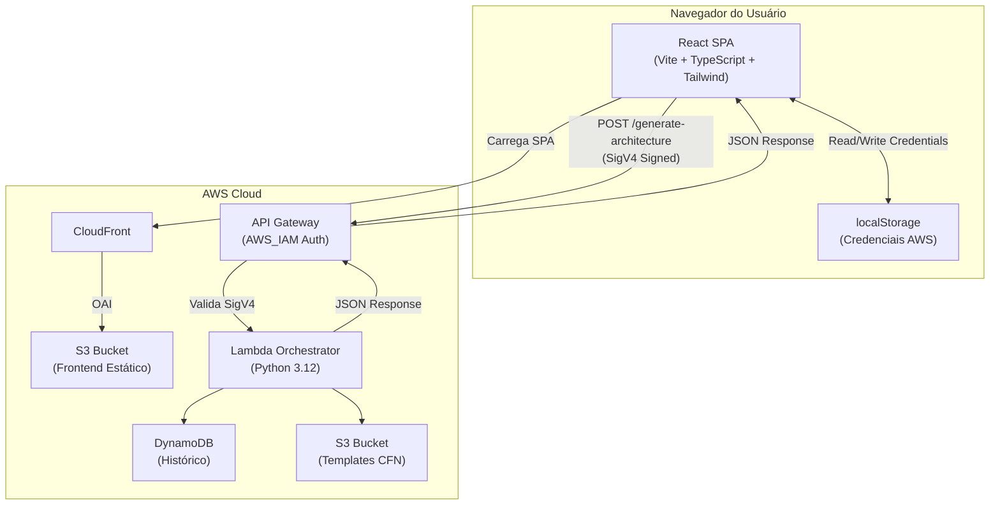
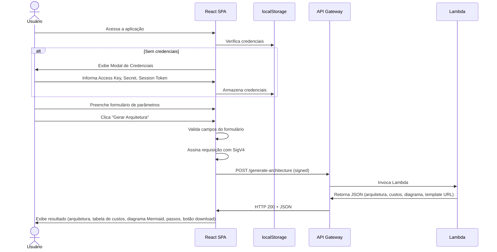
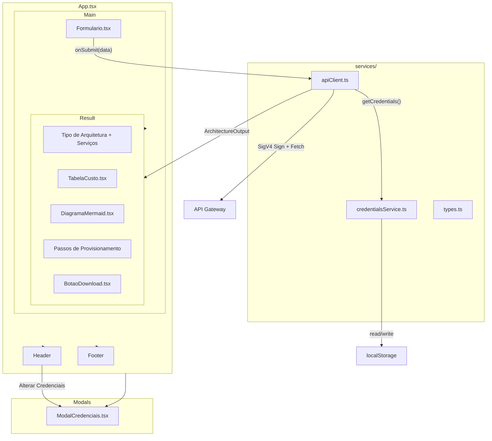

# Documento de Design — Lake House Designer Frontend

## Visão Geral

O Lake House Designer Frontend é uma Single Page Application (SPA) construída com React 18+, TypeScript, Vite e Tailwind CSS. A aplicação permite que usuários corporativos internos informem parâmetros de carga de trabalho e recebam uma recomendação de arquitetura Lake House na AWS, incluindo estimativa de custo, diagrama visual (Mermaid), passos de provisionamento e link para download do template CloudFormation.

A autenticação é feita via credenciais temporárias AWS (Access Key ID, Secret Access Key, Session Token) obtidas pelo usuário via AWS SSO / STS AssumeRole e informadas manualmente em um modal. Todas as requisições ao backend são assinadas com AWS Signature V4.

### Decisões de Design

| Decisão | Escolha | Justificativa |
|---------|---------|---------------|
| Framework UI | React 18+ com TypeScript | Tipagem forte, ecossistema maduro, requisito do projeto |
| Build Tool | Vite | Build rápido, HMR eficiente, suporte nativo a TypeScript e variáveis de ambiente `VITE_*` |
| Estilização | Tailwind CSS | Utility-first, responsividade nativa, sem overhead de runtime |
| Gerenciamento de Estado | React useState/useReducer local | Aplicação simples com fluxo unidirecional; não justifica Redux/Zustand |
| Assinatura HTTP | `@aws-sdk/signature-v4` + `@aws-crypto/sha256-js` | Bibliotecas oficiais AWS para SigV4 no browser |
| Renderização de Diagramas | `mermaid` (client-side) | Biblioteca padrão para diagramas Mermaid, renderiza SVG no browser |
| Validação de Formulário | Validação nativa com estado React | Formulário simples com 5 campos; não justifica biblioteca externa |
| Armazenamento de Credenciais | `localStorage` | Persistência entre sessões; credenciais são temporárias com expiração natural |

## Arquitetura

### Diagrama de Arquitetura de Alto Nível



### Fluxo Principal do Usuário




## Componentes e Interfaces

### Diagrama de Componentes



### Estrutura de Pastas do Projeto

```
frontend/
├── public/
│   └── index.html
├── src/
│   ├── components/
│   │   ├── Header.tsx
│   │   ├── Footer.tsx
│   │   ├── Formulario.tsx
│   │   ├── ResultadoArquitetura.tsx
│   │   ├── TabelaCusto.tsx
│   │   ├── DiagramaMermaid.tsx
│   │   ├── BotaoDownload.tsx
│   │   └── ModalCredenciais.tsx
│   ├── services/
│   │   ├── types.ts
│   │   ├── credentialsService.ts
│   │   └── apiClient.ts
│   ├── App.tsx
│   ├── App.css
│   ├── main.tsx
│   └── index.css
├── .env.example
├── package.json
├── tsconfig.json
├── vite.config.ts
├── tailwind.config.js
├── postcss.config.js
└── README.md
```

### Design de Baixo Nível — Componentes React

#### `App.tsx` — Componente Raiz

Responsabilidades:
- Gerencia o estado global da aplicação (`credentials`, `result`, `loading`, `error`)
- Controla a visibilidade do `ModalCredenciais`
- Orquestra a comunicação entre `Formulario` e `ResultadoArquitetura`

```typescript
// Estado principal do App
interface AppState {
  showCredentialsModal: boolean;
  result: ArchitectureOutput | null;
  loading: boolean;
  error: string | null;
}

// Funções principais
function App(): JSX.Element
// - Verifica credenciais no mount (useEffect)
// - handleSubmit(data: ArchitectureInput): Promise<void>
// - handleCredentialsSave(creds: AwsCredentialsInput): void
// - handleCredentialsClear(): void
// - handleOpenCredentialsModal(): void
```

#### `ModalCredenciais.tsx`

Props:
```typescript
interface ModalCredenciaisProps {
  isOpen: boolean;
  onClose: () => void;
  onSave: (credentials: AwsCredentialsInput) => void;
  onClear: () => void;
  initialValues?: AwsCredentialsInput | null;
  message?: string; // Mensagem opcional (ex: "Informe suas credenciais AWS para continuar.")
}
```

Comportamento:
- Exibe overlay modal com 3 campos de texto (Access Key ID, Secret Access Key, Session Token)
- Valida que nenhum campo está vazio ao clicar "Confirmar"
- Exibe mensagem de validação inline se campos estiverem vazios
- Preenche campos com `initialValues` quando disponível (para edição)
- Botão "Limpar Credenciais" chama `onClear`
- Botão "Confirmar" chama `onSave` com os valores preenchidos

#### `Formulario.tsx`

Props:
```typescript
interface FormularioProps {
  onSubmit: (data: ArchitectureInput) => void;
  loading: boolean;
}
```

Comportamento:
- Renderiza 5 campos com labels em português:
  - "Volume de Dados (TB)" → `data_volume_tb` (input number)
  - "Registros por Dia (milhões)" → `records_per_day_millions` (input number)
  - "Complexidade de Consulta" → `avg_query_complexity` (select: low/medium/high)
  - "Latência Máxima (segundos)" → `max_query_latency_sec` (input number)
  - "Usuários Simultâneos" → `concurrent_users` (input number)
- Validação: campos numéricos devem ser > 0, todos obrigatórios
- Exibe mensagens de erro inline por campo
- Botão "Gerar Arquitetura" desabilitado quando `loading === true`
- Exibe spinner/indicador de carregamento quando `loading === true`

#### `ResultadoArquitetura.tsx`

Props:
```typescript
interface ResultadoArquiteturaProps {
  result: ArchitectureOutput;
}
```

Comportamento:
- Renderiza seções: tipo de arquitetura, serviços, mensagem, tabela de custos, diagrama, passos, botão download
- Formata `architecture_type` para texto legível (ex: `full_lakehouse_with_redshift` → "Full Lakehouse com Redshift")

#### `TabelaCusto.tsx`

Props:
```typescript
interface TabelaCustoProps {
  costBreakdown: Record<string, number>;
  totalCost: number;
}
```

Comportamento:
- Renderiza tabela HTML com colunas "Serviço" e "Custo Mensal (USD)"
- Formata valores com `Intl.NumberFormat('en-US', { style: 'currency', currency: 'USD' })`
- Linha de rodapé com custo total em destaque (bold/background)

#### `DiagramaMermaid.tsx`

Props:
```typescript
interface DiagramaMermaidProps {
  chart: string;
}
```

Comportamento:
- Usa `mermaid.render()` via `useEffect` para converter texto Mermaid em SVG
- Exibe SVG renderizado em um container com largura responsiva
- Se o texto for inválido ou vazio, exibe mensagem "Não foi possível renderizar o diagrama."
- Usa `mermaid.initialize({ startOnLoad: false, theme: 'default' })`

#### `BotaoDownload.tsx`

Props:
```typescript
interface BotaoDownloadProps {
  templateUrl?: string;
}
```

Comportamento:
- Se `templateUrl` presente e não vazio: botão habilitado, abre URL em nova aba (`window.open`)
- Se `templateUrl` ausente ou vazio: botão desabilitado com texto "Template não disponível"

#### `Header.tsx`

Props:
```typescript
interface HeaderProps {
  onOpenCredentials: () => void;
}
```

Comportamento:
- Exibe título "Lake House Designer"
- Botão "Alterar Credenciais" que chama `onOpenCredentials`

#### `Footer.tsx`

Sem props. Exibe disclaimer: "As estimativas de custo são aproximadas e podem variar conforme o uso real dos serviços AWS."


### Design de Baixo Nível — Serviços

#### `services/types.ts`

```typescript
export interface ArchitectureInput {
  data_volume_tb: number;
  records_per_day_millions: number;
  avg_query_complexity: "low" | "medium" | "high";
  max_query_latency_sec: number;
  concurrent_users: number;
}

export interface ArchitectureOutput {
  architecture_type: "full_lakehouse_with_redshift" | "light_lakehouse_athena";
  services: string[];
  estimated_monthly_cost_usd: number;
  cost_breakdown_per_service: Record<string, number>;
  diagram_mermaid: string;
  provisioning_steps: string[];
  message: string;
  cloudformation_template_url?: string;
}

export interface AwsCredentialsInput {
  accessKeyId: string;
  secretAccessKey: string;
  sessionToken: string;
}
```

#### `services/credentialsService.ts`

```typescript
const CREDENTIALS_KEY = "lakehouse_aws_credentials";

// Retorna credenciais do localStorage ou null se não existirem
export function getCredentials(): AwsCredentialsInput | null

// Valida que os 3 campos não estão vazios e armazena no localStorage
// Retorna true se válido, false caso contrário
export function saveCredentials(creds: AwsCredentialsInput): boolean

// Remove credenciais do localStorage
export function clearCredentials(): void

// Verifica se credenciais existem e não estão vazias
export function hasCredentials(): boolean
```

Algoritmo de `saveCredentials`:
1. Verificar que `accessKeyId.trim()`, `secretAccessKey.trim()` e `sessionToken.trim()` não são strings vazias
2. Se algum campo vazio, retornar `false`
3. Serializar como JSON e salvar em `localStorage` com chave `CREDENTIALS_KEY`
4. Retornar `true`

Algoritmo de `getCredentials`:
1. Ler `localStorage.getItem(CREDENTIALS_KEY)`
2. Se `null`, retornar `null`
3. Fazer `JSON.parse` e retornar o objeto `AwsCredentialsInput`
4. Se `JSON.parse` falhar, retornar `null`

#### `services/apiClient.ts`

```typescript
import { SignatureV4 } from "@aws-sdk/signature-v4";
import { Sha256 } from "@aws-crypto/sha256-js";
import { HttpRequest } from "@aws-sdk/protocol-http";

const API_URL = import.meta.env.VITE_API_URL;
const AWS_REGION = import.meta.env.VITE_AWS_REGION;
const TIMEOUT_MS = 30000;

// Assina e envia requisição ao backend
// Lança erro com mensagem descritiva em caso de falha
export async function generateArchitecture(
  payload: ArchitectureInput,
  credentials: AwsCredentialsInput
): Promise<ArchitectureOutput>
```

Algoritmo de `generateArchitecture`:
1. Criar instância de `SignatureV4` com:
   - `credentials`: objeto com `accessKeyId`, `secretAccessKey`, `sessionToken` do parâmetro
   - `service`: `"execute-api"`
   - `region`: valor de `VITE_AWS_REGION`
   - `sha256`: `Sha256`
2. Parsear `API_URL` com `new URL()`
3. Construir `HttpRequest` com:
   - `method`: `"POST"`
   - `protocol`: protocolo da URL
   - `hostname`: hostname da URL
   - `path`: pathname da URL
   - `headers`: `{ "Content-Type": "application/json", "host": hostname }`
   - `body`: `JSON.stringify(payload)`
4. Assinar a requisição com `signer.sign(request)`
5. Executar `fetch` com `AbortController` e timeout de 30 segundos
6. Se timeout: lançar erro "A requisição excedeu o tempo limite."
7. Se `response.status === 403`: lançar erro "Erro de autorização. Suas credenciais podem ter expirado ou ser inválidas."
8. Se `response.status !== 200`: lançar erro com código de status e texto da resposta
9. Se erro de rede (TypeError do fetch): lançar erro "Erro de conexão. Verifique sua rede e tente novamente."
10. Deserializar `response.json()` e retornar como `ArchitectureOutput`

## Modelos de Dados

### Interfaces TypeScript (Contrato Frontend ↔ Backend)

#### Entrada — `ArchitectureInput`

| Campo | Tipo | Obrigatório | Validação |
|-------|------|-------------|-----------|
| `data_volume_tb` | `number` | Sim | > 0 |
| `records_per_day_millions` | `number` | Sim | > 0 |
| `avg_query_complexity` | `"low" \| "medium" \| "high"` | Sim | Enum fixo |
| `max_query_latency_sec` | `number` | Sim | > 0 |
| `concurrent_users` | `number` | Sim | > 0 |

#### Saída — `ArchitectureOutput`

| Campo | Tipo | Descrição |
|-------|------|-----------|
| `architecture_type` | `"full_lakehouse_with_redshift" \| "light_lakehouse_athena"` | Tipo de arquitetura recomendada |
| `services` | `string[]` | Lista de serviços AWS recomendados |
| `estimated_monthly_cost_usd` | `number` | Custo total mensal estimado em USD |
| `cost_breakdown_per_service` | `Record<string, number>` | Custo por serviço AWS |
| `diagram_mermaid` | `string` | Texto Mermaid do diagrama de arquitetura |
| `provisioning_steps` | `string[]` | Lista ordenada de passos de provisionamento |
| `message` | `string` | Mensagem informativa do backend |
| `cloudformation_template_url` | `string` (opcional) | URL pré-assinada do S3 para download do template CFN |

#### Credenciais — `AwsCredentialsInput`

| Campo | Tipo | Descrição |
|-------|------|-----------|
| `accessKeyId` | `string` | AWS Access Key ID |
| `secretAccessKey` | `string` | AWS Secret Access Key |
| `sessionToken` | `string` | AWS Session Token |

### Modelo de Estado da Aplicação

```typescript
// Estado gerenciado no App.tsx
interface AppState {
  showCredentialsModal: boolean;  // Controla visibilidade do modal
  result: ArchitectureOutput | null;  // Resultado da última requisição
  loading: boolean;  // Indica requisição em andamento
  error: string | null;  // Mensagem de erro para o usuário
}
```

### Armazenamento Local (localStorage)

| Chave | Valor | Descrição |
|-------|-------|-----------|
| `lakehouse_aws_credentials` | JSON serializado de `AwsCredentialsInput` | Credenciais temporárias AWS do usuário |


## Propriedades de Corretude

*Uma propriedade é uma característica ou comportamento que deve ser verdadeiro em todas as execuções válidas de um sistema — essencialmente, uma declaração formal sobre o que o sistema deve fazer. Propriedades servem como ponte entre especificações legíveis por humanos e garantias de corretude verificáveis por máquina.*

### Propriedade 1: Round-trip de credenciais

*Para quaisquer* três strings não-vazias e não compostas apenas de espaços (accessKeyId, secretAccessKey, sessionToken), salvar as credenciais via `saveCredentials` e em seguida recuperá-las via `getCredentials` deve retornar um objeto com os mesmos valores.

**Valida: Requisitos 1.2**

### Propriedade 2: Rejeição de credenciais vazias ou whitespace

*Para qualquer* conjunto de três strings onde pelo menos uma é vazia ou composta apenas de espaços em branco, `saveCredentials` deve retornar `false` e o conteúdo do `localStorage` deve permanecer inalterado.

**Valida: Requisitos 1.5**

### Propriedade 3: Serialização do corpo da requisição preserva ArchitectureInput

*Para qualquer* objeto `ArchitectureInput` válido (campos numéricos > 0, complexidade em ["low", "medium", "high"]), o corpo JSON da requisição construída pelo `apiClient` deve conter todos os campos com os mesmos valores do objeto original.

**Valida: Requisitos 2.1**

### Propriedade 4: Deserialização da resposta preserva ArchitectureOutput

*Para qualquer* objeto `ArchitectureOutput` válido serializado como JSON, a deserialização pelo `apiClient` deve produzir um objeto equivalente ao original.

**Valida: Requisitos 2.3**

### Propriedade 5: Erros HTTP contêm código de status e texto

*Para qualquer* código de status HTTP diferente de 200 (4xx, 5xx) e qualquer texto de resposta, o erro lançado pelo `apiClient` deve conter tanto o código de status quanto o texto da resposta na mensagem de erro.

**Valida: Requisitos 2.4**

### Propriedade 6: Validação do formulário rejeita entrada inválida

*Para qualquer* estado do formulário onde pelo menos um campo numérico contém valor ≤ 0 ou pelo menos um campo obrigatório está vazio, a submissão do formulário deve ser impedida e nenhuma chamada à API deve ser realizada.

**Valida: Requisitos 3.2, 3.3**

### Propriedade 7: Renderização completa da lista de serviços

*Para qualquer* array de strings de nomes de serviços AWS, o componente `ResultadoArquitetura` deve renderizar todos os nomes de serviços presentes no array no DOM.

**Valida: Requisitos 4.2**

### Propriedade 8: Renderização completa da tabela de custos

*Para qualquer* `Record<string, number>` representando o breakdown de custos por serviço, o componente `TabelaCusto` deve renderizar uma linha para cada entrada contendo o nome do serviço e o valor formatado em USD.

**Valida: Requisitos 5.1, 5.2**

### Propriedade 9: Formatação monetária em USD

*Para qualquer* número não-negativo, a formatação monetária deve produzir uma string no padrão USD com exatamente duas casas decimais (ex: "$ 2,790.00").

**Valida: Requisitos 5.4**

### Propriedade 10: Renderização completa e ordenada dos passos de provisionamento

*Para qualquer* array de strings representando passos de provisionamento, o componente deve renderizar todos os passos na mesma ordem em que aparecem no array.

**Valida: Requisitos 7.1**


## Tratamento de Erros

### Estratégia de Tratamento de Erros

A aplicação implementa tratamento de erros em múltiplas camadas:

| Camada | Tipo de Erro | Tratamento |
|--------|-------------|------------|
| **Credenciais** | Campos vazios/whitespace | Mensagem de validação inline no modal |
| **Credenciais** | Ausência ao submeter formulário | Exibe modal com mensagem "Informe suas credenciais AWS para continuar." |
| **Formulário** | Campos vazios | Mensagem de validação inline por campo: "Campo obrigatório" |
| **Formulário** | Valores numéricos ≤ 0 | Mensagem de validação inline: "O valor deve ser positivo" |
| **API — Rede** | `TypeError` do `fetch` | Mensagem: "Erro de conexão. Verifique sua rede e tente novamente." |
| **API — Autorização** | HTTP 403 | Mensagem: "Erro de autorização. Suas credenciais podem ter expirado ou ser inválidas. Clique em 'Alterar Credenciais' para informar novas credenciais." |
| **API — Timeout** | `AbortController` timeout (30s) | Mensagem: "A requisição excedeu o tempo limite. Tente novamente." |
| **API — Outros** | HTTP 4xx/5xx (exceto 403) | Mensagem: "Erro ao processar a requisição (código: {status})." |
| **Mermaid** | Texto inválido/vazio | Mensagem: "Não foi possível renderizar o diagrama." |

### Fluxo de Tratamento de Erros no `App.tsx`

```typescript
async function handleSubmit(data: ArchitectureInput): Promise<void> {
  // 1. Verificar credenciais
  const creds = getCredentials();
  if (!creds) {
    setShowCredentialsModal(true);
    setCredentialsMessage("Informe suas credenciais AWS para continuar.");
    return;
  }

  // 2. Limpar estado anterior
  setError(null);
  setLoading(true);

  try {
    // 3. Chamar API
    const result = await generateArchitecture(data, creds);
    setResult(result);
  } catch (err) {
    // 4. Tratar erro e exibir mensagem
    const message = (err as Error).message;
    setError(message);
    console.error("Erro técnico:", err);
  } finally {
    setLoading(false);
  }
}
```

### Logging

Todos os erros são registrados no `console.error` do navegador com detalhes técnicos completos (stack trace, status code, response body) para fins de depuração, conforme Requisito 8.5.

## Estratégia de Testes

### Abordagem Dual de Testes

A estratégia de testes combina testes unitários baseados em exemplos e testes baseados em propriedades (property-based testing) para cobertura abrangente.

### Biblioteca de Testes

| Ferramenta | Propósito |
|-----------|-----------|
| **Vitest** | Test runner (integrado com Vite) |
| **@testing-library/react** | Testes de componentes React |
| **fast-check** | Property-based testing |
| **jsdom** | Ambiente DOM para testes |

### Testes Baseados em Propriedades (PBT)

Cada propriedade de corretude será implementada como um teste `fast-check` com mínimo de 100 iterações.

Formato de tag: `Feature: lakehouse-designer-frontend, Property {N}: {título}`

```typescript
// Exemplo de estrutura de teste PBT
import fc from "fast-check";
import { describe, it, expect } from "vitest";

describe("credentialsService", () => {
  // Feature: lakehouse-designer-frontend, Property 1: Round-trip de credenciais
  it("should round-trip credentials through save/get", () => {
    fc.assert(
      fc.property(
        fc.string({ minLength: 1 }).filter(s => s.trim().length > 0),
        fc.string({ minLength: 1 }).filter(s => s.trim().length > 0),
        fc.string({ minLength: 1 }).filter(s => s.trim().length > 0),
        (accessKeyId, secretAccessKey, sessionToken) => {
          clearCredentials();
          const creds = { accessKeyId, secretAccessKey, sessionToken };
          saveCredentials(creds);
          const retrieved = getCredentials();
          expect(retrieved).toEqual(creds);
        }
      ),
      { numRuns: 100 }
    );
  });
});
```

### Testes Unitários (Exemplos)

| Componente/Serviço | Cenários de Teste |
|-------------------|-------------------|
| `ModalCredenciais` | Exibe quando `isOpen=true`; oculta quando `isOpen=false`; preenche com `initialValues`; exibe mensagem de validação para campos vazios |
| `Formulario` | Renderiza todos os 5 campos; desabilita botão durante loading; exibe validação para campos inválidos |
| `TabelaCusto` | Renderiza custo total no rodapé; formata valores em USD |
| `DiagramaMermaid` | Exibe mensagem de erro para texto inválido; renderiza SVG para texto válido |
| `BotaoDownload` | Habilitado com URL; desabilitado sem URL; abre URL ao clicar |
| `Header` | Exibe título; botão "Alterar Credenciais" funciona |
| `Footer` | Exibe texto de disclaimer |
| `apiClient` | Erro de rede; erro 403; timeout; resposta 200 válida |

### Testes de Integração

| Cenário | Descrição |
|---------|-----------|
| Fluxo completo sem credenciais | App carrega → modal aparece → usuário informa credenciais → modal fecha |
| Fluxo completo com credenciais | App carrega → formulário visível → preenche → submete → resultado exibido |
| Fluxo de erro 403 | Submete formulário → API retorna 403 → mensagem de erro exibida |

### Estrutura de Arquivos de Teste

```
frontend/src/
├── services/
│   ├── __tests__/
│   │   ├── credentialsService.test.ts
│   │   ├── credentialsService.property.test.ts
│   │   └── apiClient.test.ts
├── components/
│   ├── __tests__/
│   │   ├── Formulario.test.tsx
│   │   ├── Formulario.property.test.tsx
│   │   ├── TabelaCusto.test.tsx
│   │   ├── TabelaCusto.property.test.tsx
│   │   ├── DiagramaMermaid.test.tsx
│   │   ├── BotaoDownload.test.tsx
│   │   ├── ModalCredenciais.test.tsx
│   │   ├── ResultadoArquitetura.test.tsx
│   │   └── ResultadoArquitetura.property.test.tsx
```

### Configuração de Testes

```typescript
// vitest.config.ts
import { defineConfig } from "vitest/config";

export default defineConfig({
  test: {
    environment: "jsdom",
    globals: true,
    setupFiles: ["./src/test-setup.ts"],
  },
});
```

### Dependências de Teste

```json
{
  "devDependencies": {
    "vitest": "^1.0.0",
    "@testing-library/react": "^14.0.0",
    "@testing-library/jest-dom": "^6.0.0",
    "@testing-library/user-event": "^14.0.0",
    "fast-check": "^3.0.0",
    "jsdom": "^24.0.0"
  }
}
```
