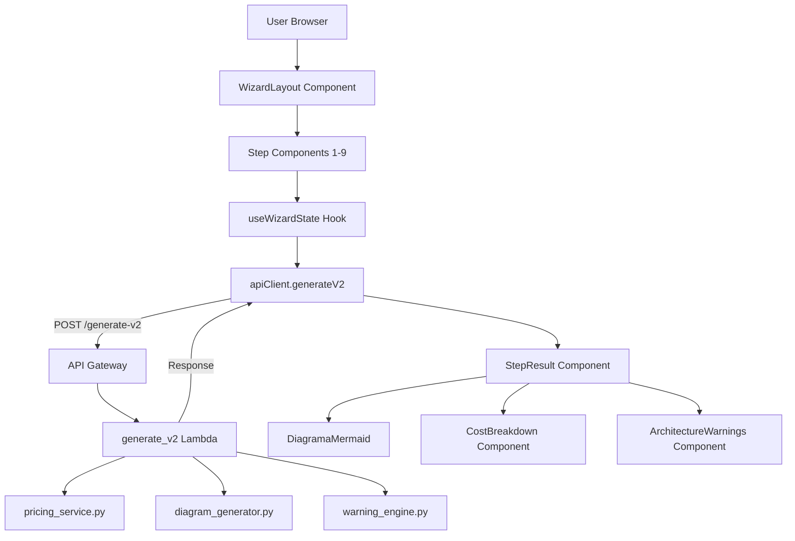
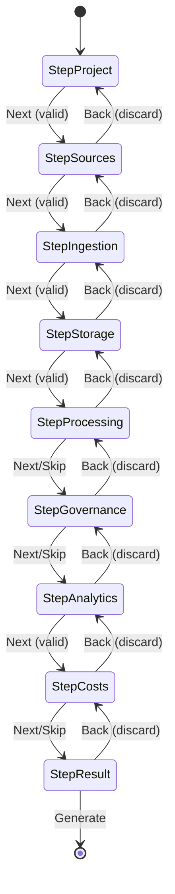
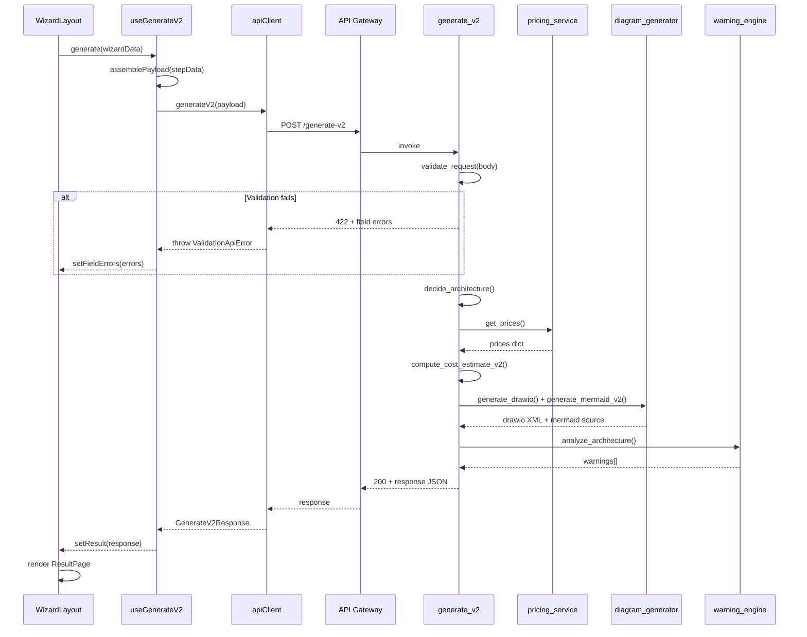
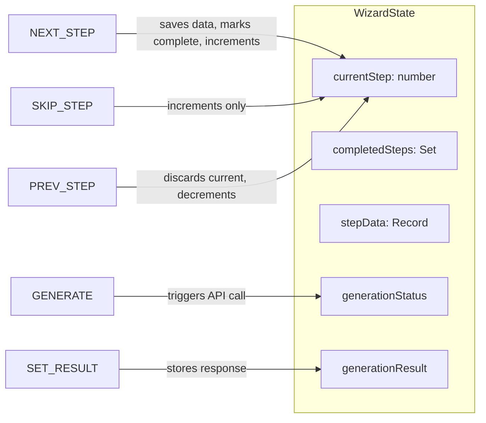

# Design Document: Lakehouse Designer V2

## Overview

Lakehouse Designer V2 transforms the existing single-form architecture into a multi-step wizard experience. The frontend introduces a `WizardLayout` component orchestrating nine sequential steps, each implemented as an isolated React component with local validation. The backend gains a new `/generate-v2` Lambda handler that accepts the expanded payload and returns enriched output including .drawio diagrams, detailed cost breakdowns, and architecture warnings. The existing `/generate-architecture` endpoint remains untouched.

## Architecture

### High-Level Data Flow



### Component Architecture

```
┌─────────────────────────────────────────────────────────────────┐
│ App.tsx                                                          │
│  ├── Header                                                      │
│  ├── WizardLayout (new)                                          │
│  │    ├── ProgressBar                                            │
│  │    ├── StepSidebar (navigation)                               │
│  │    ├── StepContent (active step component)                    │
│  │    │    ├── StepProject                                       │
│  │    │    ├── StepSources                                       │
│  │    │    ├── StepIngestion                                     │
│  │    │    ├── StepStorage                                       │
│  │    │    ├── StepProcessing                                    │
│  │    │    ├── StepGovernance                                    │
│  │    │    ├── StepAnalytics                                     │
│  │    │    ├── StepCosts                                         │
│  │    │    └── StepResult                                        │
│  │    ├── SummaryPanel (lateral)                                 │
│  │    └── NavigationButtons (Back / Next / Skip / Generate)      │
│  └── Footer                                                      │
└─────────────────────────────────────────────────────────────────┘
```

## Frontend Design

### File/Folder Structure

```
frontend/src/
├── components/
│   ├── wizard/
│   │   ├── WizardLayout.tsx          # Main wizard orchestrator
│   │   ├── ProgressBar.tsx           # Step progress indicator
│   │   ├── StepSidebar.tsx           # Lateral step navigation
│   │   ├── SummaryPanel.tsx          # Running summary of selections
│   │   ├── NavigationButtons.tsx     # Back/Next/Skip/Generate buttons
│   │   ├── steps/
│   │   │   ├── StepProject.tsx       # Step 1: Projeto
│   │   │   ├── StepSources.tsx       # Step 2: Fontes de Dados
│   │   │   ├── StepIngestion.tsx     # Step 3: Ingestão
│   │   │   ├── StepStorage.tsx       # Step 4: Storage/Lakehouse
│   │   │   ├── StepProcessing.tsx    # Step 5: Processamento
│   │   │   ├── StepGovernance.tsx    # Step 6: Governança
│   │   │   ├── StepAnalytics.tsx     # Step 7: Analytics/Serving
│   │   │   ├── StepCosts.tsx         # Step 8: Custos
│   │   │   └── StepResult.tsx        # Step 9: Resultado
│   │   └── index.ts                  # Barrel exports
│   ├── result/
│   │   ├── CostBreakdown.tsx         # Cost table + assumptions
│   │   ├── ArchitectureWarnings.tsx  # Warning list with severity
│   │   ├── JsonViewer.tsx            # Collapsible JSON display
│   │   ├── DiagramDownload.tsx       # .drawio download button
│   │   └── index.ts
│   ├── ui/
│   │   ├── Button.tsx                # Radix + Tailwind button
│   │   ├── Card.tsx                  # Card container
│   │   ├── Input.tsx                 # Form input with validation
│   │   ├── Select.tsx                # Select dropdown
│   │   ├── Tooltip.tsx               # Info tooltip
│   │   ├── Checkbox.tsx              # Checkbox primitive
│   │   └── index.ts
│   ├── DiagramaMermaid.tsx           # Existing (reused)
│   └── ... (existing components)
├── hooks/
│   ├── useWizardState.ts             # Wizard state management hook
│   └── useGenerateV2.ts             # API call hook with loading/error
├── services/
│   ├── apiClient.ts                  # Extended with generateV2
│   ├── types.ts                      # Extended with V2 types
│   └── credentialsService.ts         # Existing
└── ...
```

### State Management: `useWizardState` Hook

The wizard uses a custom hook with `useReducer` for predictable state transitions. Each step's data is stored in a typed record keyed by step index.

```typescript
// hooks/useWizardState.ts

export interface WizardStep {
  id: string;
  label: string;
  required: boolean;
  component: React.ComponentType<StepProps>;
}

export interface WizardState {
  currentStep: number;
  completedSteps: Set<number>;
  stepData: Record<number, StepData>;
  generationStatus: 'idle' | 'loading' | 'success' | 'error';
  generationResult: GenerateV2Response | null;
  generationError: string | null;
}

type WizardAction =
  | { type: 'NEXT_STEP'; data: StepData }
  | { type: 'SKIP_STEP' }
  | { type: 'PREV_STEP' }
  | { type: 'SET_GENERATION_STATUS'; status: WizardState['generationStatus'] }
  | { type: 'SET_GENERATION_RESULT'; result: GenerateV2Response }
  | { type: 'SET_GENERATION_ERROR'; error: string }
  | { type: 'RESET' };

function wizardReducer(state: WizardState, action: WizardAction): WizardState {
  switch (action.type) {
    case 'NEXT_STEP':
      return {
        ...state,
        stepData: { ...state.stepData, [state.currentStep]: action.data },
        completedSteps: new Set([...state.completedSteps, state.currentStep]),
        currentStep: state.currentStep + 1,
      };
    case 'SKIP_STEP':
      return {
        ...state,
        currentStep: state.currentStep + 1,
      };
    case 'PREV_STEP':
      // Discard current step data on back navigation
      const { [state.currentStep]: _discarded, ...remainingData } = state.stepData;
      return {
        ...state,
        stepData: remainingData,
        currentStep: state.currentStep - 1,
      };
    case 'SET_GENERATION_STATUS':
      return { ...state, generationStatus: action.status };
    case 'SET_GENERATION_RESULT':
      return { ...state, generationResult: action.result, generationStatus: 'success' };
    case 'SET_GENERATION_ERROR':
      return { ...state, generationError: action.error, generationStatus: 'error' };
    case 'RESET':
      return initialWizardState;
    default:
      return state;
  }
}

export function useWizardState() {
  const [state, dispatch] = useReducer(wizardReducer, initialWizardState);

  const nextStep = (data: StepData) => dispatch({ type: 'NEXT_STEP', data });
  const skipStep = () => dispatch({ type: 'SKIP_STEP' });
  const prevStep = () => dispatch({ type: 'PREV_STEP' });
  // ... other actions

  return { state, nextStep, skipStep, prevStep, /* ... */ };
}
```

### Step Configuration

```typescript
// components/wizard/stepConfig.ts

export const WIZARD_STEPS: WizardStep[] = [
  { id: 'project',     label: 'Projeto',            required: true,  component: StepProject },
  { id: 'sources',     label: 'Fontes de Dados',    required: true,  component: StepSources },
  { id: 'ingestion',   label: 'Ingestão',           required: true,  component: StepIngestion },
  { id: 'storage',     label: 'Storage/Lakehouse',  required: true,  component: StepStorage },
  { id: 'processing',  label: 'Processamento',      required: false, component: StepProcessing },
  { id: 'governance',  label: 'Governança',         required: false, component: StepGovernance },
  { id: 'analytics',   label: 'Analytics/Serving',  required: true,  component: StepAnalytics },
  { id: 'costs',       label: 'Custos',             required: false, component: StepCosts },
  { id: 'result',      label: 'Resultado',          required: true,  component: StepResult },
];
```


### WizardLayout Component

```typescript
// components/wizard/WizardLayout.tsx

interface WizardLayoutProps {
  onComplete?: () => void;
}

export function WizardLayout({ onComplete }: WizardLayoutProps) {
  const { state, nextStep, skipStep, prevStep, generate } = useWizardState();
  const { currentStep, completedSteps, stepData, generationStatus } = state;
  const stepConfig = WIZARD_STEPS[currentStep];
  const StepComponent = stepConfig.component;

  const isFirstStep = currentStep === 0;
  const isLastStep = currentStep === WIZARD_STEPS.length - 1;

  return (
    <div className="flex flex-col lg:flex-row gap-6 max-w-7xl mx-auto p-4 sm:p-6">
      {/* Lateral sidebar navigation */}
      <StepSidebar
        steps={WIZARD_STEPS}
        currentStep={currentStep}
        completedSteps={completedSteps}
      />

      {/* Main content area */}
      <div className="flex-1 flex flex-col gap-4">
        <ProgressBar current={currentStep} total={WIZARD_STEPS.length} />

        <Card className="flex-1 p-6">
          <StepComponent
            data={stepData[currentStep]}
            onValidSubmit={nextStep}
          />
        </Card>

        <NavigationButtons
          isFirstStep={isFirstStep}
          isLastStep={isLastStep}
          isOptional={!stepConfig.required}
          isLoading={generationStatus === 'loading'}
          onBack={prevStep}
          onNext={nextStep}
          onSkip={skipStep}
          onGenerate={generate}
        />
      </div>

      {/* Lateral summary panel */}
      <SummaryPanel
        steps={WIZARD_STEPS}
        completedSteps={completedSteps}
        stepData={stepData}
      />
    </div>
  );
}
```

### Step Component Interface

Each step component receives a common props interface:

```typescript
// components/wizard/types.ts

export interface StepProps {
  data: StepData | undefined;
  onValidSubmit: (data: StepData) => void;
}

export type StepData =
  | ProjectData
  | SourcesData
  | IngestionData
  | StorageData
  | ProcessingData
  | GovernanceData
  | AnalyticsData
  | CostsData;

export interface ProjectData {
  project_name: string;
  environment: 'dev' | 'staging' | 'prod';
  region: string;
  description?: string;
}

export interface SourcesData {
  data_volume_tb: number;
  records_per_day_millions: number;
  data_source_count: number;
  dms_cdc_enabled: boolean;
  dms_cdc_db_count?: number;
  source_types: string[];
}

export interface IngestionData {
  ingestion_pattern: 'batch' | 'streaming' | 'hybrid';
  batch_frequency?: 'hourly' | 'daily' | 'weekly';
  streaming_throughput_mbps?: number;
}

export interface StorageData {
  storage_tiers: ('raw' | 'curated' | 'aggregated')[];
  compression: 'snappy' | 'gzip' | 'zstd' | 'none';
  file_format: 'parquet' | 'orc' | 'iceberg' | 'delta';
  partitioning_strategy?: string;
}

export interface ProcessingData {
  etl_engine: 'glue' | 'emr' | 'emr_serverless';
  job_concurrency: number;
  data_quality_enabled: boolean;
}

export interface GovernanceData {
  lake_formation_enabled: boolean;
  column_level_security: boolean;
  data_catalog_tags?: string[];
  encryption: 'sse_s3' | 'sse_kms' | 'cse';
}

export interface AnalyticsData {
  query_engine: 'athena' | 'redshift' | 'both';
  avg_query_complexity: 'low' | 'medium' | 'high';
  max_query_latency_sec: number;
  concurrent_users: number;
  redshift_node_count?: number;
  external_api_count: number;
  quicksight_enabled: boolean;
}

export interface CostsData {
  budget_limit_usd?: number;
  cost_allocation_tags?: string[];
  create_estimate: boolean;
}
```

### Validation Strategy

Each step component manages its own validation using a `useStepValidation` hook:

```typescript
// hooks/useStepValidation.ts

export interface ValidationRule {
  field: string;
  validate: (value: unknown) => string | null; // returns error message or null
}

export function useStepValidation(rules: ValidationRule[]) {
  const [errors, setErrors] = useState<Record<string, string>>({});
  const [touched, setTouched] = useState<Set<string>>(new Set());

  const validateField = (field: string, value: unknown) => {
    const rule = rules.find(r => r.field === field);
    if (!rule) return null;
    const error = rule.validate(value);
    setErrors(prev => {
      if (error) return { ...prev, [field]: error };
      const { [field]: _, ...rest } = prev;
      return rest;
    });
    return error;
  };

  const validateAll = (data: Record<string, unknown>): boolean => {
    const newErrors: Record<string, string> = {};
    for (const rule of rules) {
      const error = rule.validate(data[rule.field]);
      if (error) newErrors[rule.field] = error;
    }
    setErrors(newErrors);
    setTouched(new Set(rules.map(r => r.field)));
    return Object.keys(newErrors).length === 0;
  };

  const touchField = (field: string) => {
    setTouched(prev => new Set([...prev, field]));
  };

  return { errors, touched, validateField, validateAll, touchField };
}
```

## Backend Design

### New Endpoint: `/generate-v2`

The new endpoint is implemented as a separate Lambda handler (`generate_v2.py`) registered on a new API Gateway route. It shares `pricing_service.py` with the existing orchestrator but introduces new modules for diagram generation and warning analysis.

### Backend File Structure

```
backend/src/
├── orchestrator.py           # Existing (unchanged)
├── pricing_service.py        # Existing (shared, unchanged)
├── generate_v2.py            # NEW: Lambda handler for /generate-v2
├── diagram_generator.py      # NEW: .drawio XML generation + Mermaid
├── warning_engine.py         # NEW: Architecture warning analysis
├── schema_v2.py              # NEW: Request/response validation schemas
└── requirements.txt          # Updated with new deps
```

### Request Schema

```typescript
// POST /generate-v2 request body

interface GenerateV2Request {
  // Step 1: Projeto
  project: {
    project_name: string;
    environment: 'dev' | 'staging' | 'prod';
    region: string;
    description?: string;
  };
  // Step 2: Fontes de Dados
  sources: {
    data_volume_tb: number;           // > 0
    records_per_day_millions: number;  // > 0
    data_source_count: number;        // >= 0
    dms_cdc_enabled: boolean;
    dms_cdc_db_count?: number;        // >= 1 if dms_cdc_enabled
    source_types: string[];
  };
  // Step 3: Ingestão
  ingestion: {
    ingestion_pattern: 'batch' | 'streaming' | 'hybrid';
    batch_frequency?: 'hourly' | 'daily' | 'weekly';
    streaming_throughput_mbps?: number;
  };
  // Step 4: Storage/Lakehouse
  storage: {
    storage_tiers: string[];
    compression: 'snappy' | 'gzip' | 'zstd' | 'none';
    file_format: 'parquet' | 'orc' | 'iceberg' | 'delta';
    partitioning_strategy?: string;
  };
  // Step 5: Processamento (optional)
  processing?: {
    etl_engine: 'glue' | 'emr' | 'emr_serverless';
    job_concurrency: number;
    data_quality_enabled: boolean;
  };
  // Step 6: Governança (optional)
  governance?: {
    lake_formation_enabled: boolean;
    column_level_security: boolean;
    data_catalog_tags?: string[];
    encryption: 'sse_s3' | 'sse_kms' | 'cse';
  };
  // Step 7: Analytics/Serving
  analytics: {
    query_engine: 'athena' | 'redshift' | 'both';
    avg_query_complexity: 'low' | 'medium' | 'high';
    max_query_latency_sec: number;
    concurrent_users: number;
    redshift_node_count?: number;
    external_api_count: number;
    quicksight_enabled: boolean;
  };
  // Step 8: Custos (optional)
  costs?: {
    budget_limit_usd?: number;
    cost_allocation_tags?: string[];
    create_estimate: boolean;
  };
}
```

### Response Schema

```typescript
// POST /generate-v2 response body

interface GenerateV2Response {
  diagram: {
    content_base64: string;    // Base64-encoded .drawio XML
    filename: string;          // e.g. "lakehouse-myproject-2024-01-15.drawio"
  };
  spec_source: 'deterministic' | 'sagemaker';
  spec: DiagramSpec;           // JSON describing architecture components
  cost_estimate: CostEstimate;
  warnings: ArchitectureWarning[];
  mermaid_diagram: string;     // Mermaid source for inline preview
  provisioning_steps: string[];
  cloudformation_template_url?: string;
  pricing_calculator_url?: string;
}

interface DiagramSpec {
  architecture_type: string;
  services: ServiceNode[];
  connections: Connection[];
  layers: Layer[];
}

interface ServiceNode {
  id: string;
  service: string;
  label: string;
  layer: string;
  config?: Record<string, unknown>;
}

interface Connection {
  from: string;
  to: string;
  label?: string;
  type: 'data_flow' | 'control' | 'monitoring';
}

interface Layer {
  id: string;
  label: string;
  order: number;
}

interface CostEstimate {
  monthly_total_usd: number;
  breakdown: CostBreakdownItem[];
  assumptions: string[];
  notes: string[];
  unit_prices: Record<string, number>;
  pricing_location: string;
  pricing_api_region: string;
}

interface CostBreakdownItem {
  service: string;
  monthly_cost_usd: number;
  unit_price: number;
  unit: string;
  quantity: number;
}

interface ArchitectureWarning {
  severity: 'info' | 'warning' | 'critical';
  code: string;
  message: string;
  recommendation?: string;
}
```


### Error Response Schema (HTTP 422)

```typescript
interface ValidationErrorResponse {
  error: 'validation_error';
  message: string;
  fields: FieldError[];
}

interface FieldError {
  path: string;       // e.g. "sources.data_volume_tb"
  message: string;    // e.g. "Must be greater than 0"
  code: string;       // e.g. "value_error.number.not_gt"
}
```

### Backend Handler: `generate_v2.py`

```python
# backend/src/generate_v2.py

import json
import logging
from schema_v2 import validate_request, ValidationError
from pricing_service import get_prices
from diagram_generator import generate_drawio, generate_mermaid_v2
from warning_engine import analyze_architecture

logger = logging.getLogger(__name__)


def lambda_handler(event, context):
    """Handler for POST /generate-v2."""
    try:
        body = json.loads(event.get('body', '{}'))
    except json.JSONDecodeError:
        return _error_response(400, 'Invalid JSON body')

    # 1. Validate request schema
    try:
        validated = validate_request(body)
    except ValidationError as e:
        return _validation_error_response(e.errors)

    # 2. Determine architecture decisions
    architecture = decide_architecture(validated)

    # 3. Generate cost estimate
    prices = get_prices()
    cost_estimate = compute_cost_estimate_v2(validated, architecture, prices)

    # 4. Generate diagrams
    mermaid_src = generate_mermaid_v2(architecture)
    drawio_content = generate_drawio(architecture, validated['project'])
    drawio_b64 = base64.b64encode(drawio_content.encode('utf-8')).decode('ascii')
    filename = build_diagram_filename(validated['project'])

    # 5. Analyze warnings
    warnings = analyze_architecture(validated, architecture, cost_estimate)

    # 6. Build spec
    spec = build_diagram_spec(architecture)

    # 7. Build response
    response = {
        'diagram': {
            'content_base64': drawio_b64,
            'filename': filename,
        },
        'spec_source': 'deterministic',
        'spec': spec,
        'cost_estimate': cost_estimate,
        'warnings': warnings,
        'mermaid_diagram': mermaid_src,
        'provisioning_steps': get_provisioning_steps_v2(architecture),
    }

    return {
        'statusCode': 200,
        'headers': cors_headers(),
        'body': json.dumps(response),
    }


def _error_response(status, message):
    return {
        'statusCode': status,
        'headers': cors_headers(),
        'body': json.dumps({'error': message}),
    }


def _validation_error_response(errors):
    return {
        'statusCode': 422,
        'headers': cors_headers(),
        'body': json.dumps({
            'error': 'validation_error',
            'message': 'Request body validation failed',
            'fields': errors,
        }),
    }


def cors_headers():
    return {
        'Content-Type': 'application/json',
        'Access-Control-Allow-Origin': '*',
        'Access-Control-Allow-Headers': 'Content-Type,Authorization,X-Amz-Date,X-Api-Key,X-Amz-Security-Token,X-Amz-Content-Sha256',
        'Access-Control-Allow-Methods': 'POST,OPTIONS',
    }
```

### Schema Validation: `schema_v2.py`

```python
# backend/src/schema_v2.py

from typing import Optional

VALID_ENVIRONMENTS = {'dev', 'staging', 'prod'}
VALID_INGESTION_PATTERNS = {'batch', 'streaming', 'hybrid'}
VALID_COMPRESSIONS = {'snappy', 'gzip', 'zstd', 'none'}
VALID_FILE_FORMATS = {'parquet', 'orc', 'iceberg', 'delta'}
VALID_ETL_ENGINES = {'glue', 'emr', 'emr_serverless'}
VALID_QUERY_ENGINES = {'athena', 'redshift', 'both'}
VALID_COMPLEXITIES = {'low', 'medium', 'high'}
VALID_ENCRYPTIONS = {'sse_s3', 'sse_kms', 'cse'}


class ValidationError(Exception):
    def __init__(self, errors: list[dict]):
        self.errors = errors
        super().__init__(f"Validation failed: {len(errors)} error(s)")


def validate_request(body: dict) -> dict:
    """Validate the /generate-v2 request body. Raises ValidationError on failure."""
    errors = []

    # Required top-level sections
    for section in ('project', 'sources', 'ingestion', 'storage', 'analytics'):
        if section not in body or not isinstance(body[section], dict):
            errors.append({
                'path': section,
                'message': f'Section "{section}" is required and must be an object',
                'code': 'missing_required_section',
            })

    if errors:
        raise ValidationError(errors)

    # Validate each section
    errors.extend(_validate_project(body['project']))
    errors.extend(_validate_sources(body['sources']))
    errors.extend(_validate_ingestion(body['ingestion']))
    errors.extend(_validate_storage(body['storage']))
    errors.extend(_validate_analytics(body['analytics']))

    if 'processing' in body and body['processing']:
        errors.extend(_validate_processing(body['processing']))
    if 'governance' in body and body['governance']:
        errors.extend(_validate_governance(body['governance']))

    if errors:
        raise ValidationError(errors)

    return body


def _validate_project(data: dict) -> list[dict]:
    errors = []
    if not data.get('project_name') or not isinstance(data['project_name'], str):
        errors.append({'path': 'project.project_name', 'message': 'Required string', 'code': 'required'})
    if data.get('environment') not in VALID_ENVIRONMENTS:
        errors.append({'path': 'project.environment', 'message': f'Must be one of {VALID_ENVIRONMENTS}', 'code': 'invalid_enum'})
    if not data.get('region') or not isinstance(data['region'], str):
        errors.append({'path': 'project.region', 'message': 'Required string', 'code': 'required'})
    return errors
# ... additional validators follow same pattern
```

### Warning Engine: `warning_engine.py`

```python
# backend/src/warning_engine.py

def analyze_architecture(request: dict, architecture: dict, cost_estimate: dict) -> list[dict]:
    """Analyze architecture for potential issues and return warnings."""
    warnings = []

    sources = request.get('sources', {})
    analytics = request.get('analytics', {})
    cost = cost_estimate.get('monthly_total_usd', 0)

    # High cost warning
    budget = request.get('costs', {}).get('budget_limit_usd')
    if budget and cost > budget:
        warnings.append({
            'severity': 'critical',
            'code': 'OVER_BUDGET',
            'message': f'Estimated cost (${cost:.2f}/mo) exceeds budget limit (${budget:.2f}/mo)',
            'recommendation': 'Consider reducing node count or switching to serverless options',
        })

    # Large volume without Redshift
    if sources.get('data_volume_tb', 0) > 50 and analytics.get('query_engine') == 'athena':
        warnings.append({
            'severity': 'warning',
            'code': 'LARGE_VOLUME_ATHENA_ONLY',
            'message': 'Data volume exceeds 50TB with Athena-only query engine',
            'recommendation': 'Consider adding Redshift for complex queries at this scale',
        })

    # High concurrency without Redshift
    if analytics.get('concurrent_users', 0) > 50 and analytics.get('query_engine') == 'athena':
        warnings.append({
            'severity': 'warning',
            'code': 'HIGH_CONCURRENCY_ATHENA',
            'message': 'High concurrent users (>50) with Athena may cause throttling',
            'recommendation': 'Consider Redshift or Redshift Serverless for high concurrency',
        })

    # DMS without governance
    if sources.get('dms_cdc_enabled') and not request.get('governance', {}).get('lake_formation_enabled'):
        warnings.append({
            'severity': 'info',
            'code': 'CDC_NO_GOVERNANCE',
            'message': 'CDC replication enabled without Lake Formation governance',
            'recommendation': 'Enable Lake Formation for fine-grained access control on replicated data',
        })

    return warnings
```

### SAM Template Addition

```yaml
# Addition to backend/template.yaml

  GenerateV2Function:
    Type: AWS::Serverless::Function
    Properties:
      CodeUri: src/
      Handler: generate_v2.lambda_handler
      Tags:
        CLIENTE: !Ref TagCliente
        AMBIENTE: !Ref TagAmbiente
        PROJETO: !Ref TagProjeto
        AUTOR: !Ref TagAutor
      Policies:
        - DynamoDBCrudPolicy:
            TableName: !Ref HistoryTable
        - S3CrudPolicy:
            BucketName: !Ref TemplatesBucket
        - CloudWatchLogsFullAccess
        - Version: "2012-10-17"
          Statement:
            - Effect: Allow
              Action:
                - pricing:GetProducts
                - pricing:DescribeServices
              Resource: "*"
      Environment:
        Variables:
          TEMPLATES_BUCKET: !Ref TemplatesBucket
          TABLE_NAME: !Ref HistoryTable
      Events:
        ApiEvent:
          Type: Api
          Properties:
            RestApiId: !Ref LakeHouseAPI
            Path: /generate-v2
            Method: POST
```

## Frontend API Client Extension

```typescript
// services/apiClient.ts (additions)

import type { GenerateV2Request, GenerateV2Response, ValidationErrorResponse } from "./types";

const API_BASE_URL = import.meta.env.VITE_API_BASE_URL;
const TIMEOUT_MS = 60_000; // 60s for V2 (more complex generation)

export class ApiConfigError extends Error {
  constructor() {
    super('VITE_API_BASE_URL is not configured. Check your .env file.');
    this.name = 'ApiConfigError';
  }
}

export class ValidationApiError extends Error {
  public fields: Array<{ path: string; message: string; code: string }>;

  constructor(response: ValidationErrorResponse) {
    super(response.message);
    this.name = 'ValidationApiError';
    this.fields = response.fields;
  }
}

export async function generateV2(
  payload: GenerateV2Request
): Promise<GenerateV2Response> {
  if (!API_BASE_URL) {
    throw new ApiConfigError();
  }

  const controller = new AbortController();
  const timeoutId = setTimeout(() => controller.abort(), TIMEOUT_MS);

  try {
    const response = await fetch(`${API_BASE_URL}/generate-v2`, {
      method: 'POST',
      headers: { 'Content-Type': 'application/json' },
      body: JSON.stringify(payload),
      signal: controller.signal,
    });

    clearTimeout(timeoutId);

    if (response.status === 422) {
      const errorBody = await response.json() as ValidationErrorResponse;
      throw new ValidationApiError(errorBody);
    }

    if (response.status === 403) {
      throw new Error('Erro de autorização. Recarregue a página e tente novamente.');
    }

    if (!response.ok) {
      const text = await response.text();
      throw new Error(`Erro HTTP ${response.status}: ${text}`);
    }

    return (await response.json()) as GenerateV2Response;
  } catch (error) {
    clearTimeout(timeoutId);

    if (error instanceof DOMException && error.name === 'AbortError') {
      throw new Error('A requisição excedeu o tempo limite (60s). Tente novamente.');
    }

    if (error instanceof TypeError) {
      throw new Error('Erro de conexão. Verifique sua rede e tente novamente.');
    }

    throw error;
  }
}
```

## Data Flow Diagrams

### Wizard Navigation Flow



### API Request/Response Flow



### State Management Flow



## Environment Configuration

```bash
# frontend/.env.example
VITE_API_BASE_URL=https://your-api-id.execute-api.us-east-1.amazonaws.com/prod
```

The `apiClient` validates that `VITE_API_BASE_URL` is defined before making requests. If undefined, it throws `ApiConfigError` which the UI surfaces as a configuration error message rather than attempting a request to `undefined/generate-v2`.

## Error Handling Strategy

| Layer | Error Type | Handling |
|-------|-----------|----------|
| Step Validation | Missing/invalid fields | Inline error messages, block navigation |
| API Client | Network error | User-friendly connectivity message |
| API Client | Timeout (60s) | User-friendly timeout message |
| API Client | HTTP 422 | Parse field errors, surface to step components |
| API Client | HTTP 403 | Auth error message, clear credentials |
| API Client | HTTP 5xx | Generic server error message |
| Backend | Invalid JSON | HTTP 400 |
| Backend | Schema validation | HTTP 422 with field-level errors |
| Backend | Pricing API failure | Fallback to hardcoded prices (existing behavior) |
| Backend | Diagram generation failure | Return response without diagram, add warning |

## Base64 Download Implementation

```typescript
// components/result/DiagramDownload.tsx

export function downloadDrawio(contentBase64: string, filename: string): void {
  const binaryString = atob(contentBase64);
  const bytes = new Uint8Array(binaryString.length);
  for (let i = 0; i < binaryString.length; i++) {
    bytes[i] = binaryString.charCodeAt(i);
  }
  const blob = new Blob([bytes], { type: 'application/xml' });
  const url = URL.createObjectURL(blob);
  const link = document.createElement('a');
  link.href = url;
  link.download = filename;
  document.body.appendChild(link);
  link.click();
  document.body.removeChild(link);
  URL.revokeObjectURL(url);
}
```
